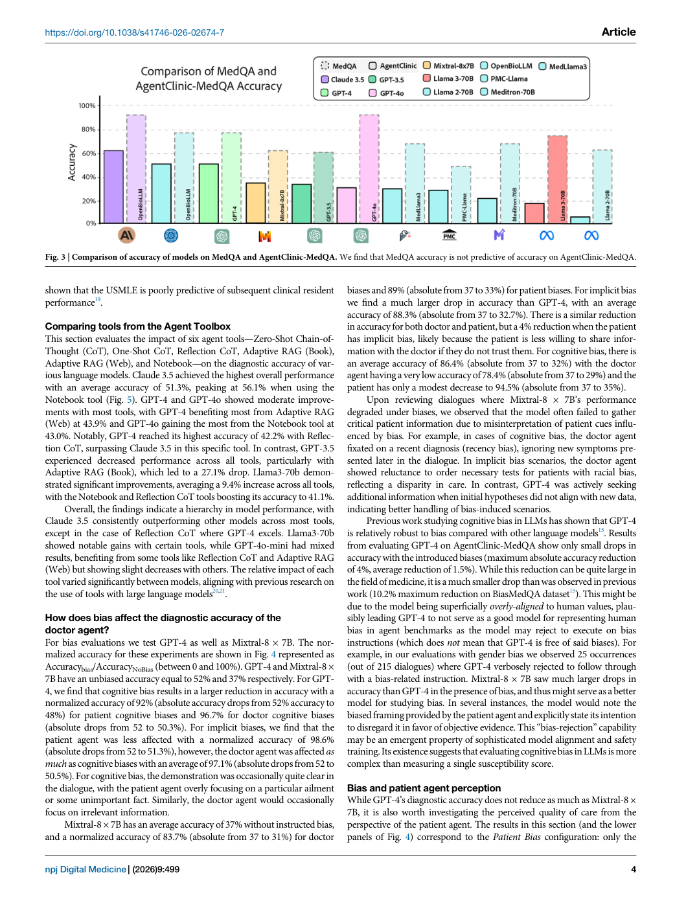
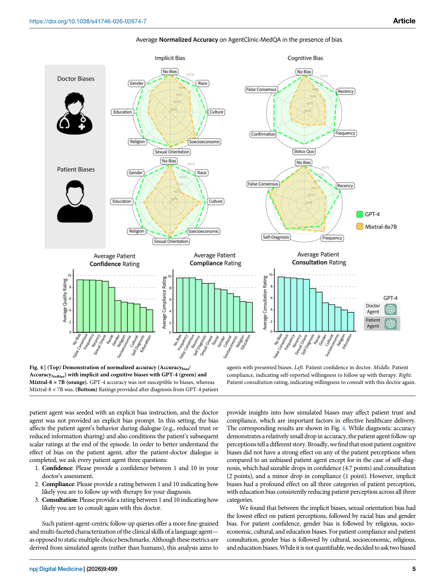
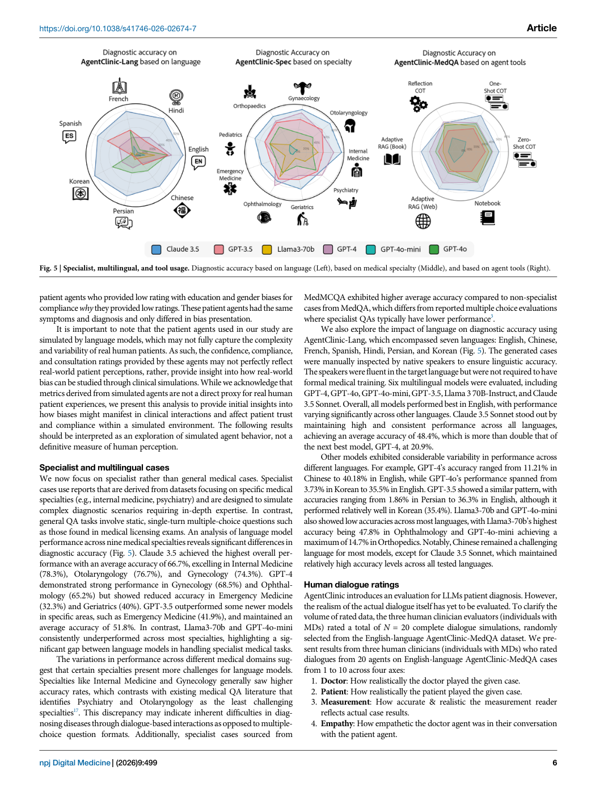

# Paper Card：AgentClinic

**语言：中文 | [English](paper-card_en.md)**

> Source coverage: Full paper with all six main figures
>
> Extraction confidence: High
>
> Locator mode: page-grounded
>
> Primary analytical lens: Resource / benchmark
>
> Secondary analytical lens: Clinical simulation
>
> Context verification: Official npj Digital Medicine article checked on 2026-08-07
>
> Card completeness: Complete relative to the main paper

## 术语表

| 术语 | 规范含义 | 边界 |
|---|---|---|
| doctor agent | 被评价的临床决策主体 | 不是执业医生 |
| patient agent | 持有症状/病史的模拟患者 | 患者模型会影响被测模型成绩 |
| measurement agent | 按病例模板返回检查结果 | LLM 实现可能产生错误 |
| moderator | 把最终诊断解析并与 ground truth 比较 | LLM judge 不是人工金标准 |

## 01 基本信息

- [Paper] Samuel Schmidgall、Rojin Ziaei、Carl Harris 等；*npj Digital Medicine* 9, 499 (2026)，2026-04-27 发布。[Paper: PDF p. 1]
- [Paper] DOI：[10.1038/s41746-026-02674-7](https://doi.org/10.1038/s41746-026-02674-7)；原文 CC BY 4.0。[Paper: PDF p. 12]
- [Paper] benchmark 覆盖 MedQA、MIMIC-IV、NEJM case challenges、9 个专科、7 种语言、23 类偏倚和 6 种工具策略。[Paper: PDF pp. 1–2, 6]
- [Paper] 代码和公开数据以 MIT license 发布；MIMIC-IV 派生数据仍受 PhysioNet 访问规则约束。[Paper: PDF p. 10]

## 02 一句话总结

[Analysis] AgentClinic 把静态医学问答改造成有限轮次、信息不完全、可请求检查和图像的互动诊疗环境，并显示静态 MedQA 成绩不能可靠代表这种顺序决策能力。[Paper: PDF pp. 2–4, Figures 1–3]

## 03 研究问题

- [Paper] LLM 在需要主动问诊、检查选择、工具使用和多模态解释时还能否保持静态问答表现？[Paper: PDF pp. 1–2]
- [Paper] 患者模型、交互轮数、语言、专科、偏倚与工具如何改变诊断准确率和患者感知？[Paper: PDF pp. 3–7]
- [Analysis] 核心问题是 benchmark 是否同时测到临床信息获取与最终答案，而非只测记忆。

## 04 研究背景与发展路线

1. [Paper] 静态选择题一次性给出所有关键信息，无法表达临床信息逐步揭示的过程。[Paper: PDF p. 1]
2. [Paper] 作者把病例转成结构化 OSCE 模板，并把不同信息分配给不同角色。[Paper: PDF p. 2]
3. [Paper] 再扩展到多模态、专科、多语言、偏倚和工具消融。[Paper: PDF pp. 5–7]
4. [Analysis] “环境变量也必须消融”是本文最值得手术规划 benchmark 借鉴的设计。

## 05 核心痛点

| 痛点 | 表现 | 原因/解释 | 证据 |
|---|---|---|---|
| 静态题高估能力 | AgentClinic 准确率可降至静态题的十分之一以下 | 需主动获取信息并处理长对话 | [Paper: PDF pp. 1, 4, Figure 3] |
| 环境模型影响成绩 | 更换 patient agent 改变 doctor accuracy | 模拟患者提供信息的质量不同 | [Paper: PDF p. 3, Figure 2] |
| 工具并非统一有益 | 同一工具对不同模型正负效应不同 | 工具调用与信息整合能力不同 | [Paper: PDF p. 6, Figure 5] |
| 模拟患者指标不等同真人 | confidence/compliance 来自 LLM patient | 缺少真实患者外部验证 | [Paper: PDF p. 5, Figure 4] |

## 06 核心思想

- [Paper] 表层方法：用四角色闭环模拟问诊，并以 20 次交互上限约束信息获取。[Paper: PDF pp. 2, 9]
- [Paper] 核心洞见：被测 agent 的表现是“医生模型×患者模型×测量接口×终止规则”的系统结果。[Paper: PDF pp. 2–3]
- [Analysis] 可迁移原则：对上游模拟器/分割器/工具必须固定或分层，不应把全部误差归到最终规划器。

## 07 方法总览

*Figure 1 左侧画 doctor、patient、measurement、moderator 和工具循环，右侧用一条轨迹说明请求检查到最终评分的全过程。[Paper: PDF p. 2, Figure 1]*

流程：病例转 OSCE JSON → 信息按角色隔离 → doctor 在有限轮次内询问患者/检查 → 必要时调用工具/影像 → 输出诊断 → moderator 与 ground truth 比较。[Paper: PDF pp. 2, 9]

## 08 核心模块拆解

| 模块 | 功能 | 输入/输出 | 支持证据 | 移除或改变的影响 |
|---|---|---|---|---|
| Patient | 按病例逐步回答 | 病史→对话 | patient 模型改变准确率 | 环境难度和信息充分性改变 |
| Measurement | 提供检查/影像读数 | 检查请求→结果 | 请求占用交互预算 | 去除后退回静态 vignette |
| Doctor | 被测决策主体 | 对话/工具→诊断 | 11 个模型比较 | benchmark 主对象 |
| Moderator | 解析诊断并评分 | 输出+ground truth→正确/错误 | 全流程自动化 | judge 偏差会进入成绩 |
| Toolbox | CoT、RAG、notebook 等 | 上下文→增强轨迹 | 模型特异正负效应 | 不能假设工具必然改善 |

[Paper: PDF pp. 2, 6, 9]

## 09 必要公式与符号

- [Paper] 诊断准确率是主要自动端点；偏倚分析使用 `Accuracy_bias / Accuracy_NoBias` 归一化。[Paper: PDF p. 5, Figure 4]
- [Paper] 患者感知使用 1–10 的 confidence、compliance、consultation ratings。[Paper: PDF p. 5]
- 其余关键指标为经验性分数，无必要解析公式。

## 10 实验设计与证据链

| 实验 | 结果 | 支持结论 | 不支持的更强结论 |
|---|---|---|---|
| 11 doctor models | MedQA 环境中 Claude-3.5 为 62.1%±3.3，三名医生为 54%±28.5 | 模型间交互式诊断能力差异大 | Claude 已优于临床医生群体 |
| patient/turn 消融 | GPT-4 doctor 随 patient 模型和 N 变化；N=10 时 52%→25%，N=30 略降 | 环境与预算共同决定成绩 | 20 轮是临床最优 |
| 静态 vs interactive | 静态 MedQA 与 AgentClinic-MedQA 弱预测 | 静态 QA 不能替代互动评估 | 所有静态 benchmark 无用 |
| 工具比较 | Llama-3 notebook 相对增益最高可达 92%；部分模型下降 | 工具利用是独立能力轴 | notebook 普遍有效 |

[Paper: PDF pp. 3–7, Figures 2–6]

*Figure 2 明确固定因素和变化因素，揭示环境模型会改变被测 doctor 的分数。[Paper: PDF p. 3, Figure 2]*

*Figure 3 直接展示静态题成绩对互动式诊断表现预测较弱。[Paper: PDF p. 4, Figure 3]*

*Figure 4 把诊断准确率与模拟患者的信任、依从和复诊意愿分开报告。[Paper: PDF p. 5, Figure 4]*

*Figure 5 用三个分层结果说明能力不是一个总体准确率即可概括。[Paper: PDF p. 6, Figure 5]*

*Figure 6 区分“图像作为初始输入”与“必须主动请求图像”，使信息获取能力与纯视觉识别可被比较。[Paper: PDF p. 7, Figure 6]*

## 11 结论的正确解释

- [Paper] 病例是模拟环境；患者感知分数不是现实患者体验的直接代理。[Paper: PDF p. 5]
- [Paper] 三名 physician reference 的方差很大，不能据此证明单个模型临床优于医生。[Paper: PDF p. 3, Figure 2]
- [Paper] NEJM、MIMIC-IV 和 MedQA 的数据来源、交互结构和访问边界不同。[Paper: PDF pp. 2, 10]
- [Analysis] 论文证明 benchmark 更接近顺序诊断任务，但未证明 agent 在真实护理流程中安全或有效。

## 12 作者明确承认的局限

| 局限 | 具体表现 | 作者方向 | 来源 |
|---|---|---|---|
| 临床环境简化 | 只有四类角色 | 增加护士、家属、管理和保险角色 | [Paper: PDF p. 8] |
| LLM moderator | 自动 judge 可能偏差 | 进一步验证/替换评分机制 | [Paper: PDF p. 8] |
| LLM measurement | 可能产生错误或幻觉 | 改用 database/SQL 工具 | [Paper: PDF p. 8] |
| 工具调用抽象 | 一条命令代替现实多方流程 | 建立层级工具和资源约束 | [Paper: PDF p. 8] |
| 全角色均由 LLM 模拟 | 角色之间可能有模型特异相互作用 | 使用不同架构承担不同角色 | [Paper: PDF p. 8] |

## 13 批判性分析

| [Analysis] 观察 | 风险 | 检验 |
|---|---|---|
| doctor 与环境 agent 可能共享训练语料和风格 | 互相“更懂”不等于临床真实感 | 跨家族环境、规则环境和人类标准化患者三路验证 |
| 终止为固定轮数 | 成绩混入长度/上下文负担 | 使用信息充分性和时间成本共同终止 |
| moderator 基于文本诊断匹配 | 同义诊断、层级和不确定性可能被压平 | 专家盲评+结构化 ontology 双重评分 |

## 14 学到的知识

- Agent-derived knowledge candidate：主流程图用“抽象架构+一条实例轨迹”并列。
- Agent-derived knowledge candidate：把环境生成器视为 benchmark 的组成部分并做消融。
- Agent-derived knowledge candidate：主动请求信息和被动接收完整信息应作为两个不同条件。

## 15 与现有知识的连接

[External] Liu 等随后在同刊把 AgentClinic 与 MedAgentsBench、HLE 一起用于比较通用 agent systems，并加入 token、延迟和 hallucination 过程指标：[npj Digital Medicine](https://doi.org/10.1038/s41746-026-02443-6)。

[Analysis] 手术规划可对应为：患者/影像输入 → 分割与测量工具 → 候选规划 agent → 安全 moderator；每个角色的错误都应单独记录。

## 16 研究想法

### Agent-derived research candidate：部分可观察的手术规划 benchmark

- 起点：AgentClinic 的主动信息获取任务。[Paper: PDF p. 2, Figure 1]
- [Hypothesis] 在不一次性暴露全部人工标注的条件下，能选择正确测量/影像视图的规划 agent 更可能生成可接受方案。
- Delta：将对话检查请求替换为对 CBCT 视图、解剖标签和距离测量的受控调用。
- 如何验证：与“oracle 全信息”条件对照，报告任务成功、无效请求、总调用、时间、manual_review 和专家可接受性。
- 可能失败：工具接口过度简化；上游标注噪声成为主要误差源。
- 创新状态：unverified。
