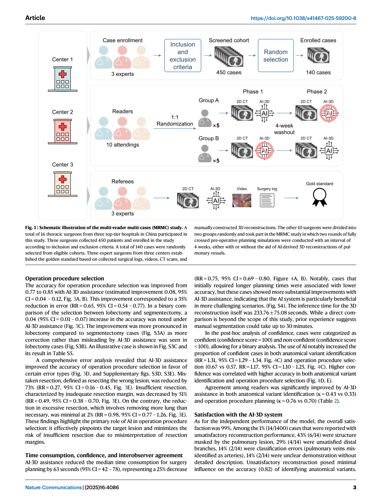
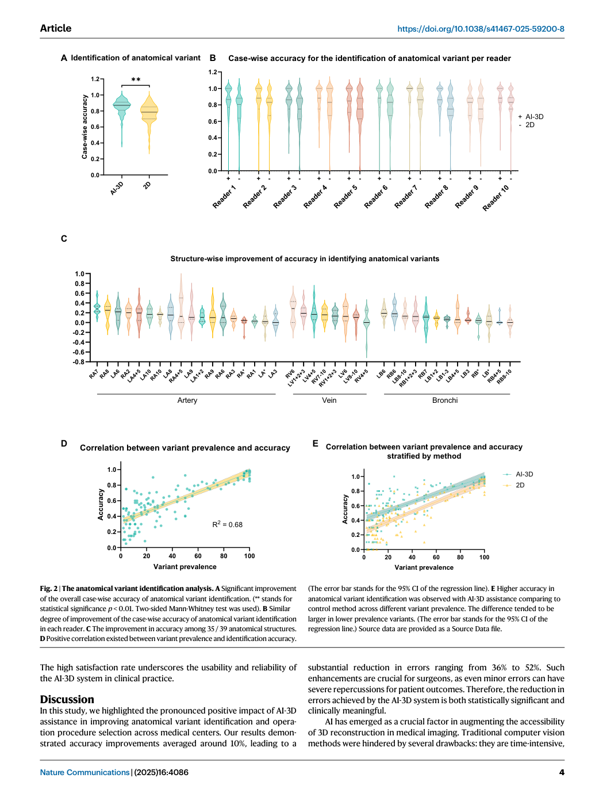
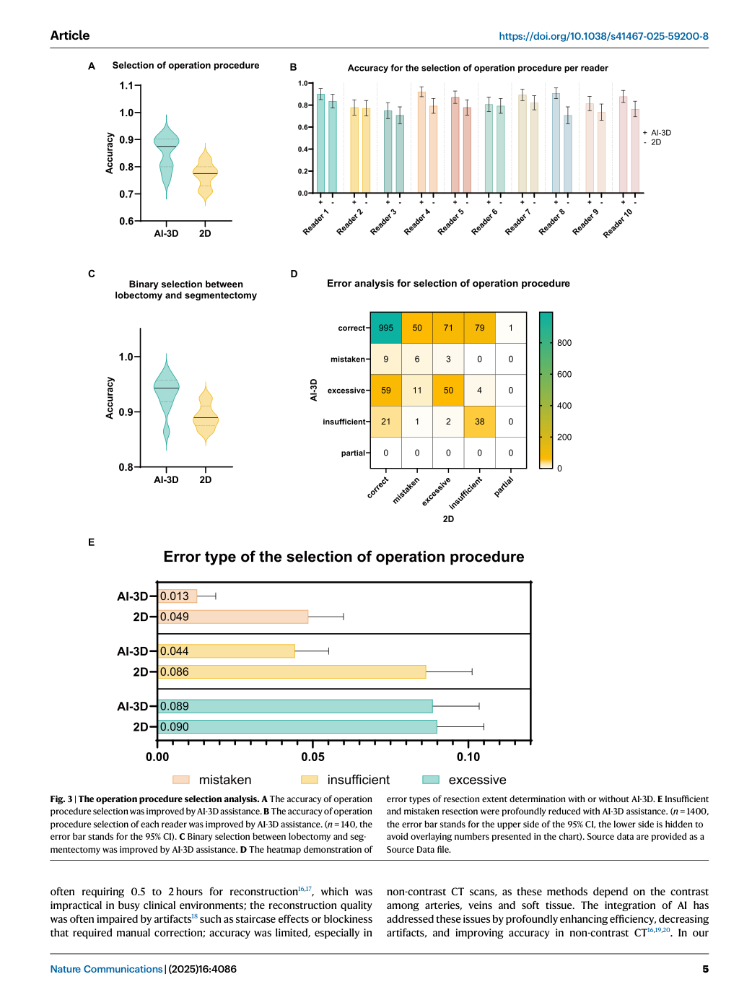
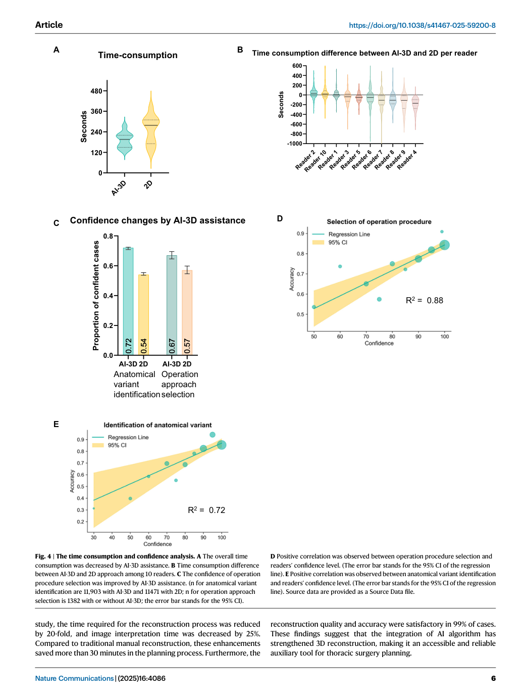

# Paper Card：Artificial intelligence driven 3D reconstruction for enhanced lung surgery planning

**语言：中文 | [English](paper-card_en.md)**

> Source coverage: Full paper with all main-text figures and tables, plus official Supplementary Information
>
> Extraction confidence: High
>
> Locator mode: Page-grounded
>
> Primary lens: Clinical evaluation
>
> Secondary lens: Methods and benchmark design
>
> Context verification: Official Nature Communications article and PubMed record checked on 2026-08-05
>
> Completeness: Complete relative to the main paper and official Supplementary Information

## Terminology Ledger

| Canonical term | 中文释义 | 本卡片中的边界 |
|---|---|---|
| AI-3D system | AI驱动三维重建系统 | InferOperate Thorax；为医生提供肺血管、支气管和病灶的三维可视化，不是自主手术方案生成器 |
| MRMC | 多阅片者、多病例研究 | multi-reader multi-case；10名医生均在两种条件下评估全部140例 |
| reader | 阅片者/外科医生 | 参加模拟术前规划的10名胸外科医生 |
| expert panel | 专家组 | 3名资深胸外科医生，建立参考答案并裁决分歧 |
| gold standard | 金标准/参考标准 | 由CT、人工三维重建、手术视频和手术记录共同建立的事后参考答案 |
| operation procedure selection | 手术术式选择 | 包括肺叶切除/肺段切除及更具体的切除范围，不等同于完整手术执行方案 |
| anatomical variant identification | 解剖结构/变异识别 | 逐病例核对计划相关肺血管和支气管结构是否识别正确 |
| assistance condition | AI辅助条件 | 医生阅读2D CT并使用AI-3D；评价对象是“医生+AI”组合 |
| control condition | 对照条件 | 医生仅使用常规2D CT进行规划 |

## 01 基本信息

- [Paper] 题目：*Artificial intelligence driven 3D reconstruction for enhanced lung surgery planning*。
- [Paper] 第一作者：Xiuyuan Chen、Chenyang Dai、Muyun Peng、Dawei Wang（共同第一作者）；通讯作者团队包括Yuming Zhu、Fenglei Yu和Fan Yang。[Paper: PDF p.1]
- [Paper] 期刊：*Nature Communications*，2025，16:4086；发表于2025年5月1日。
- [Paper] DOI：<https://doi.org/10.1038/s41467-025-59200-8>
- [Paper] 研究类型：回顾性、三中心、两阶段、完全交叉MRMC读者研究。[Paper: PDF pp.2–3, Fig. 1]
- [Paper] 研究对象：从连续纳入的450例中随机抽取140例，其中肺叶切除62例、肺段切除78例；10名胸外科医生作为readers。[Paper: PDF pp.2–3, Table 1, Fig. 1]
- [Paper] 干预：医生使用AI-3D重建辅助规划；对照：医生只使用2D CT。[Paper: PDF p.3, Fig. 1]
- [Paper] 主要终点：逐病例解剖结构识别准确率。[Paper: PDF pp.3, 8]
- [Paper] 资金与利益关系：研究部分由北京推想科技有限公司（Infervision）资助，多名作者为该公司员工；软件为专有产品。[Paper: PDF p.10]

## 02 一句话总结

[Analysis] 这篇论文最有价值的不是证明“AI能独立设计手术”，而是用严格的交叉MRMC框架证明：同一批胸外科医生在同一批病例上使用AI生成的三维解剖信息后，比仅看2D CT更准确、更一致、规划更快；它是一个高质量的**人机协作型手术规划benchmark模板**。

## 03 研究问题

- [Paper] 主要问题：AI-3D辅助能否提高胸外科医生在肺叶/肺段切除术前识别相关解剖结构的准确率？[Paper: PDF pp.1, 8]
- [Paper] 次要问题：AI-3D能否改善术式选择、减少特定错误、缩短规划时间、提高医生信心和阅片者间一致性？[Paper: PDF pp.4–7, Figs. 3–4, Table 2]
- [Analysis] 它没有直接检验：AI单独是否优于医生、AI生成的分割是否达到某个Dice、实际手术是否因此减少出血/并发症、或者患者结局是否改善。

## 04 研究背景与发展路径

1. [Paper] 常规肺外科术前规划依赖2D CT，但复杂、远端和低频肺血管/支气管变异难以直观理解。[Paper: PDF p.1]
2. [Paper] 人工三维重建能改善空间理解，但人工分割耗时，限制日常使用。[Paper: PDF p.1]
3. [Paper] AI可自动生成三维模型，但技术分割性能不等于临床规划获益，因此作者把评价终点前移到“医生在规划任务中是否更准确”。[Paper: PDF pp.1–2]
4. [Paper] 既往关于术中时间等下游结局的证据并不一致，因此本研究先验证更接近AI作用机制的术前规划终点。[Paper: PDF pp.1–2]
5. [Analysis] 这是从“模型是否分得准”走向“模型是否改变临床决策质量”的关键一步，但仍未到“改善患者结局”的最后一层。

## 05 核心痛点

- [Paper] 二维切片使复杂三维解剖关系难以被快速、稳定地复原。
- [Paper] 少见变异更容易漏认，而这类错误可能影响血管处理和切除范围。
- [Paper] 人工三维重建耗时，临床可扩展性有限。
- [Paper] 单纯报告模型分割精度不能回答医生是否真正受益。
- [Analysis] 临床AI benchmark的真正难题不是找一个单一数字，而是同时处理病例差异、医生差异、两者交互、顺序效应、记忆效应和参考标准独立性。

## 06 核心思想

[Paper] 让每一名reader对每一个病例都在“仅2D CT”和“2D CT + AI-3D”两种条件下完成规划，通过随机分组、交叉、至少28天洗脱和病例顺序随机化，让每名医生同时充当自己的对照。[Paper: PDF p.3, Fig. 1; Supplementary PDF pp.25–41]

[Analysis] 这使论文检验的因果问题非常明确：**加入AI-3D这一信息层后，医生的任务表现发生了什么变化？** 它不是比较两个互不相同的医生队列，也不是拿AI答案直接对专家答案做静态一致性比较。

## 07 方法总览

### 7.1 整体流程

1. [Paper] 三个中心连续收集450名符合条件的患者。
2. [Paper] 随机选取140例构成reader study数据集。
3. [Paper] 三名专家使用CT、人工三维重建、真实手术视频和手术记录建立gold standard；两名专家独立判断，分歧由第三名专家裁决。[Paper: PDF p.3, Fig. 1; Supplementary PDF pp.25–41]
4. [Paper] 10名reader随机分为两组，每组5名。
5. [Paper] 第一阶段：一组使用AI-3D，另一组仅使用2D CT；所有reader均评估全部140例。
6. [Paper] 至少28天洗脱后，两组交换条件，再次评估全部140例；病例呈现顺序随机。[Paper: PDF p.3, Fig. 1]
7. [Paper] 比较解剖识别、术式选择、错误类型、规划时间、信心和一致性。

*Figure 1把病例筛选、三专家参考标准、10名reader随机分组、两阶段交叉和4周洗脱压缩到同一张流程图中。它画的是评价实验如何运行，而不是AI网络内部结构。[Paper: PDF p.3, Figure 1]*

### 7.2 主文图表的叙事分工

| 图表 | 它回答的问题 | 推荐借鉴点 |
|---|---|---|
| Fig. 1 | benchmark是怎么运行的？ | 用“病例来源—参考标准—reader随机分组—两阶段交叉—洗脱期”讲设计，而不是堆模型模块 |
| Fig. 2 | AI是否改善主要终点，改善是否稳定？ | 总体分布、逐reader结果、逐结构结果、患病率/变异频率关联由总到细展开 |
| Fig. 3 | AI如何改变临床决策及错误构成？ | 总体术式准确率、逐reader、二分类、错误热图、错误类型RR组成一条证据链 |
| Fig. 4 | 是否更高效、更有信心？ | 时间、个体差异、信心和信心—准确率关系作为辅助结果 |
| Table 2 | 医生之间是否更一致？ | 用κ值说明AI不仅改变平均表现，也改变决策一致性 |

## 08 核心模块拆解

### 8.1 AI-3D系统

- [Paper] 支气管：patch-based 3D U-Net分割。[Paper: PDF p.8]
- [Paper] 肺内血管：2.5D网络；纵隔血管：3D网络；再用区域生长向外周血管延伸。[Paper: PDF p.8]
- [Paper] 可视化：Marching Cubes生成表面网格，RayCasting和DepthPeeling进行渲染。[Paper: PDF p.8]
- [Paper] 系统还集成病灶检测和交互式显示。[Paper: Supplementary PDF pp.56–57, 75–77]
- [Paper] 产品说明明确表示不能脱离医生独立用于手术规划。[Paper: Supplementary PDF pp.73–77]

### 8.2 参考标准

- [Paper] 参考标准不是单一医生的术前意见，而是三名资深专家结合术前影像、人工三维模型和真实手术资料建立的结构与术式答案。[Paper: PDF p.3, Fig. 1]
- [Analysis] 这种设计提高了解剖“真值”的可信度，但手术视频和手术记录属于术后可获得的信息，因此它更像事后oracle reference，不完全等同于只使用术前资料的独立专家规划。

### 8.3 评价对象

- [Paper] 评价单位不是裸AI输出，而是reader在两种信息条件下的表现。
- [Analysis] 因而论文结论应写成“AI-3D assistance improved surgeons’ performance”，不能改写成“AI-3D independently planned surgery with 85% accuracy”。

## 09 必要公式与符号

### 9.1 逐病例解剖识别准确率

[Paper]

\[
Accuracy_{case}=\frac{\text{reader正确识别的计划相关结构数}}{\text{专家参考中该病例的计划相关结构总数}}
\]

[Paper: Supplementary PDF pp.38–40]

### 9.2 错误相对风险

[Analysis]

\[
RR_{error}=\frac{1-Accuracy_{AI}}{1-Accuracy_{Control}}
\]

例如0.87对0.78时，粗略错误率比约为0.13/0.22=0.59，即错误相对减少约41%。这比仅报告“准确率提高9个百分点”更能显示错误负担的变化，但两者应同时报告，避免只突出相对效应。

### 9.3 DBMH多阅片者多病例模型

[Paper] 主要分析采用Dorfman–Berbaum–Metz–Hillis（DBMH）方法，通过jackknife伪值同时处理方法、reader、病例及交互项：[Paper: Supplementary PDF pp.38–40]

\[
Y_{ijk}=\mu+\tau_i+R_j+C_k+(\tau R)_{ij}+(RC)_{jk}+(\tau C)_{ik}+(\tau RC)_{ijk}+\epsilon_{n(ijk)}
\]

其中 \(\tau_i\) 是阅读方法固定效应，\(R_j\) 和 \(C_k\) 分别是reader和病例效应。主要优越性假设为 \(H_0:\tau_2-\tau_1\leq0\)，优越性界值为0。[Paper: Supplementary PDF p.40]

## 10 实验设计与证据链

### 10.1 样本与比较

- [Paper] 140例 × 10名reader × 2种条件，理论上形成2800次病例级规划评价。
- [Paper] 病例覆盖5个肺叶；reader年龄34–45岁，临床经验6–19年，均为board-certified胸外科医生。[Paper: PDF pp.2–3]
- [Paper] 918/24,400个解剖结构条目缺失（3.8%），主分析按错误处理；排除缺失后的敏感性分析方向一致。[Paper: PDF p.4]

### 10.2 主要结果

*Figure 2由总体病例准确率、逐reader分布、39种解剖结构的改善分布，以及患病率—准确率关系组成。它支持“总体改善具有跨reader和跨结构表现”，但不同结构的收益并不均一。[Paper: PDF p.4, Figure 2]*

| 结果 | 仅2D CT | AI-3D辅助 | 效应 | 证据位置 |
|---|---:|---:|---|---|
| 解剖识别准确率，中位数 | 0.78 | 0.87 | 错误RR 0.59（95% CI 0.56–0.63）；p<0.01 | [Paper: PDF p.4, Fig. 2A] |
| 术式选择准确率 | 0.77 | 0.85 | 绝对提高0.08（95% CI 0.04–0.12）；错误RR 0.65 | [Paper: PDF p.5, Fig. 3A–B] |
| 肺叶/肺段二分类 | — | — | 绝对提高0.04（95% CI 0.01–0.07） | [Paper: PDF p.5, Fig. 3C] |
| 规划时间 | — | — | 中位减少63秒（95% CI 42–78）；相对减少25% | [Paper: PDF p.6, Fig. 4A–B] |
| 解剖识别阅片者一致性 | κ=0.33 | κ=0.43 | 提高但仍仅中等一致性 | [Paper: PDF p.7, Table 2] |
| 术式选择阅片者一致性 | κ=0.70 | κ=0.76 | 小幅提高 | [Paper: PDF p.7, Table 2] |

### 10.3 错误类型结果

*Figure 3把术式选择准确率、逐reader差异、肺叶/肺段二分类、决策转移热图和错误类型并列呈现。最重要的边界是：mistaken与insufficient resection下降，而excessive resection没有清楚改善。[Paper: PDF p.5, Figure 3]*

- [Paper] 错误病灶切除（mistaken resection）减少73%：RR 0.27（95% CI 0.16–0.45）。[Paper: PDF p.5, Fig. 3E]
- [Paper] 切除不足（insufficient resection）减少51%：RR 0.49（95% CI 0.38–0.70）。[Paper: PDF p.5, Fig. 3E]
- [Paper] 过度切除（excessive resection）几乎没有改善：RR 0.98（95% CI 0.77–1.26）。[Paper: PDF p.5, Fig. 3E]
- [Paper] 在肺叶切除病例中，AI纠正68次错误、误导19次；肺段切除中纠正42次、误导32次。[Paper: Supplementary PDF, Fig. S3B]
- [Analysis] “纠正—误导”转移矩阵比只报总体准确率更临床化，因为它直接显示AI改变原判断后是帮忙还是添错。

### 10.4 时间、信心和可用性

*Figure 4展示reader规划时间、逐reader时间差、完全有信心的比例及信心—准确率关系。这里的时间结果是reader任务时间，不包含把AI重建推理耗时合并成一个端到端时间指标。[Paper: PDF p.6, Figure 4]*

- [Paper] AI重建本身平均推理耗时233.76±75.08秒；论文报告的63秒减少是reader规划/解读时间，不应自动理解为完整端到端流程节省63秒。[Paper: PDF p.6]
- [Paper] 事后分析把信心分为100分与低于100分；AI增加“完全有信心”比例，且信心与准确率正相关。[Paper: PDF p.6, Fig. 4C–E]
- [Paper] 99%满意度来自1400次reader使用评价；14次不满意包括病灶遮挡结构、远端分支不足、动静脉误分类和显示不清。[Paper: PDF p.7]

### 10.5 Claim–evidence矩阵

| 论文主张 | 直接支持证据 | 支持强度 | 不能外推到 |
|---|---|---|---|
| AI辅助提高解剖识别 | 完全交叉MRMC主要终点、DBMH分析、敏感性分析 | 较强 | AI独立识别能力、真实术中安全性 |
| AI辅助改善术式选择 | 同一reader的交叉比较及错误类型分析 | 中等偏强 | 真实执行的最终术式或长期肿瘤结局 |
| AI辅助缩短规划时间 | reader任务计时 | 中等 | 包含233秒重建在内的端到端周转时间 |
| AI对低频变异更有帮助 | 患病率—准确率探索性回归 | 假设生成 | 已确认的低频变异适应证 |
| 系统临床可靠 | 99%使用满意度 | 有限 | 独立技术准确性或患者安全性 |

## 11 结论的正确解释

### 可以说

- [Paper] 在这140例、10名胸外科医生的模拟术前规划中，AI-3D辅助提高了解剖识别和术式选择表现，并减少规划时间。
- [Paper] 改善在10名reader中方向一致，且错误类型分析显示对错误病灶和切除不足的帮助更明显。
- [Analysis] 该研究支持human-in-the-loop三维解剖辅助工具的临床任务价值。

### 不能说

- [Analysis] 不能说AI独立生成了正确手术方案；最终回答来自医生。
- [Analysis] 不能说改善了患者结局、减少出血或并发症；研究没有随机实施这些AI辅助方案并观察患者结局。
- [Analysis] 不能把99%满意度当作99%模型准确率。
- [Analysis] 不能把0.85术式选择准确率理解为完整手术方案85%正确；它只覆盖论文定义的术式选择任务。
- [Analysis] 不能把探索性的低频变异/低信心亚组趋势当成预先验证的适应证。

## 12 作者明确承认的局限

1. [Paper] 术前识别改善不等于出血、手术时间、并发症等患者结局改善；需要前瞻性试验/RCT。[Paper: PDF p.7]
2. [Paper] 少见解剖变异代表不足，相关结论仍需专门数据集验证。[Paper: PDF p.7]
3. [Paper] 术式参考采用“切缘不小于结节直径”的规则，未覆盖病理切缘和局部复发等更复杂因素。[Paper: PDF p.7]
4. [Paper] 低频变异、低信心和困难病例的获益属于未预设的探索性分析，可能样本量不足。[Paper: PDF p.7]
5. [Paper] MRMC模拟不能完整复制真实工作流中的顺序、工作负荷、团队动态和错误后果。[Paper: PDF p.7]

## 13 批判性分析

### 13.1 设计强项

- [Analysis] 完全交叉设计使每名reader成为自身对照，显著减少医生能力差异的混杂。
- [Analysis] 28天洗脱和病例顺序随机化降低记忆及顺序效应。
- [Analysis] 主要终点采用MRMC/DBMH方法，正确承认病例和reader双重聚类。
- [Analysis] 同时报绝对准确率、错误RR、逐reader结果、错误类型和敏感性分析，证据链比单一平均值完整。
- [Analysis] 把“AI纠正”和“AI误导”同时呈现，避免只描述净获益。

### 13.2 关键风险

- [Analysis] 参考标准含手术视频/记录，是可信的事后解剖真值，但不是与reader完全输入对等的术前专家计划。
- [Analysis] 纳入高质量、层厚≤2 mm CT，排除既往肺手术、胸部创伤、图像质量差和跨叶侵犯；结果未必适用于更差图像和更复杂病例。[Paper: PDF p.8]
- [Analysis] reader均为有6–19年经验的主治及以上医师，不能推断实习生或初学者的效应。
- [Analysis] 解剖准确率把不同结构按计数汇总，没有按临床伤害严重度加权；漏认一支关键血管与漏认低风险分支的后果不同。
- [Analysis] Fig. 2图注使用Mann–Whitney检验，而方法学又将DBMH作为主要MRMC分析；论文没有把图中描述性检验与主要聚类校正推断的层级解释得足够清楚。
- [Analysis] 主文样本量段落出现“pilot effect size 0.13”后又写“conservative effect size of 0.7”，补充材料写计划效应0.08；更像排版/表述错误，但不能擅自修正。[Paper: PDF p.8; Supplementary PDF pp.40–41]
- [Analysis] 信心被事后二分为100与<100，阈值极端且非预设；它适合描述，不适合独立证明校准改善。
- [Analysis] 多项次要和探索性分析较多，若没有充分的多重性控制，应优先看效应量与置信区间。
- [Analysis] 企业参与、专有软件和数据/代码不可完全复现构成外部独立验证的必要性。

## 14 学到的知识

### 关于主流程图

- [Analysis] Figure 1画的是**评价实验的工作流**，不是算法管线。对benchmark论文，这通常比把所有网络模块塞进主图更重要。
- [Analysis] 最清晰的视觉骨架是：病例池 → 随机抽样 → 独立参考标准 → reader随机分组 → 阶段1 → 洗脱 → 阶段2交叉 → 终点评价。
- [Analysis] 图中必须让读者一眼看到三种独立性：病例来源、参考标准来源、被评价reader。

### 关于结果图

- [Analysis] 结果叙事遵循“总体效应 → 个体稳定性 → 任务细分 → 错误机制 → 效率/信心”。
- [Analysis] 同一结果同时给绝对差、相对错误RR和95% CI，比只有p值更有解释力。
- [Analysis] 热图和错误类型图回答“为什么/在哪里改善”；逐reader图回答“是否由少数医生驱动”；这两类图都比单一柱状图信息量高。
- [Analysis] 未改善的错误类型（过度切除RR 0.98）应保留在主图中，它定义了系统能力边界，也增强可信度。

## 15 与现有知识/ImplantAgent连接

### 15.1 最值得直接借鉴的不是肺部算法，而是benchmark结构

- [Analysis] 独立专家参考：参考制定者不能看到ImplantAgent输出；若使用术后植体位置或手术记录，要明确它是“实施结果”还是“术前理想计划”，不能混为同一gold standard。
- [Analysis] 患者级完全隔离：开发、内部验证、外部验证按患者分割，多个FDI位点需在统计中保留病例内聚类。
- [Analysis] 双层评价：第一层评价冻结后的ImplantAgent独立输出；第二层若要证明临床辅助价值，再做“医生单独 vs 医生+ImplantAgent”的MRMC交叉研究。
- [Analysis] 不建议把这两层合成一个准确率，因为“模型本身好不好”和“模型能否帮助医生”是两个不同问题。

### 15.2 可迁移的结果框架（提案，尚未获项目批准）

| 肺手术论文 | ImplantAgent可对应的候选表达 | 状态 |
|---|---|---|
| 解剖结构识别准确率 | 独立专家判定的病例/位点级临床可接受性 | [Hypothesis] 待批准 |
| 术式选择准确率 | 有无方案、植体数量、FDI位点、尺寸类别或关键处置建议的一致性 | [Hypothesis] 待批准 |
| 错误类型热图 | 漏规划、不必要规划、位置不安全、角度不当、尺寸不当、无方案/弃权、需人工纠正 | [Hypothesis] 待批准 |
| corrected vs misled | 医生原判断→加入Agent后变正确/变错误的转移矩阵 | [Hypothesis] 待批准 |
| 逐reader结果 | 逐医生辅助效应及经验分层 | [Hypothesis] 待批准 |
| 时间/信心 | 规划用时、人工修改次数、信心与信心—准确率/校准关系 | [Hypothesis] 待批准 |
| 几何未覆盖 | 入口点、根尖点、轴角、长度、直径和关键结构安全距离的连续误差 | [Analysis] ImplantAgent必须额外增加 |

### 15.3 建议的主图逻辑（不是已接受方案）

- [Hypothesis] Figure 1：病例与数据分割 → 独立专家参考 → 冻结Agent生成方案 → 专家盲评/几何比较 → 可选MRMC医生辅助研究。
- [Hypothesis] Figure 2：总体临床可接受性 + 每病例/每FDI + 关键几何误差分布。
- [Hypothesis] Figure 3：错误类型热图 + 无方案/弃权 + corrected/misled转移矩阵。
- [Hypothesis] Figure 4：困难亚组、规划时间、人工修改和失败案例。

[Analysis] 这里最重要的表述边界是：若ImplantAgent当前自动输出几何并在不可靠时进入manual review或不生成方案，应分别报告“产生辅助输出的比例”“自主给出推荐的比例”“临床可接受的比例”，不能把这些状态合并为一个成功率。

## 16 研究构想

### 构想1：冻结系统benchmark与临床MRMC分层验证

- [Hypothesis] Origin：本论文验证的是“医生+AI”，但ImplantAgent还需要先证明独立输出本身的质量。
- [Hypothesis] Testable hypothesis：ImplantAgent独立输出在外部患者级测试集上达到预设临床可接受性；随后医生+Agent相较医生单独能提高计划质量或减少时间，且不会增加严重错误。
- [Hypothesis] Delta from paper：增加冻结的standalone arm，并保证standalone和assistance两个问题分别设定终点与样本量。
- [Hypothesis] Minimal validation：独立双专家盲评+第三专家裁决；患者级聚类模型；预先登记严重错误、弃权和人工修正；MRMC阶段设置洗脱和随机顺序。
- [Hypothesis] Failure modes：专家参考不独立、reader记忆病例、把manual review算成功、病例级与位点级分母混用、严重错误被平均值掩盖。
- [Hypothesis] 创新状态（Innovation status）：Unverified；需用户审批后才能进入正式benchmark方案。

### 构想2：计划组件的纠正—误导转移矩阵

- [Hypothesis] Origin：本论文Supplementary Fig. S3B同时展示AI纠正和误导，而不是只报净准确率。
- [Hypothesis] Testable hypothesis：对入口点、轴向、尺寸和安全处置等组件，Agent引入后的“错误→正确”转移显著多于“正确→错误”，且严重误导率低于预设安全界值。
- [Hypothesis] Delta from paper：从单一术式标签扩展到多组件三维计划，并按临床严重度分层。
- [Hypothesis] Minimal validation：每个组件保留医生单独、Agent独立、医生+Agent和专家参考四个状态；报告转移矩阵、绝对数量、比例和置信区间。
- [Hypothesis] Failure modes：只报净改善、修改标准不统一、同一病例多个组件相关性未处理。
- [Hypothesis] 创新状态（Innovation status）：Unverified。

### 构想3：把弃权/人工复核作为安全结果而非缺失值

- [Hypothesis] Origin：论文把缺失答案按错误处理并做敏感性分析；ImplantAgent本身存在manual review或no-plan状态。
- [Hypothesis] Testable hypothesis：选择性输出策略能在可控覆盖率下降的同时，显著降低严重不安全计划率。
- [Hypothesis] Delta from paper：把缺失进一步拆为技术失败、安全弃权、解剖不可判定和人工复核，而非统一当作错误或剔除。
- [Hypothesis] Minimal validation：报告coverage–risk曲线、各状态分母、严重错误率、复核后可恢复比例，并做最坏情况敏感性分析。
- [Hypothesis] Failure modes：把弃权从分母中删除造成表观准确率膨胀；人工复核产出的几何被误计为自主输出。
- [Hypothesis] 创新状态（Innovation status）：Unverified。

---

### Source boundary

- [Paper] 主论文及补充材料支持本卡片中带`[Paper]`的设计、数字和作者结论。
- [Analysis] 带`[Analysis]`的内容是对证据边界、潜在偏倚及其与ImplantAgent关系的分析，不是原作者原话。
- [Hypothesis] 带`[Hypothesis]`的内容是待验证、待用户批准的研究构想，不构成当前项目已接受的终点或方案。

### Primary sources

1. Chen X, Dai C, Peng M, et al. Artificial intelligence driven 3D reconstruction for enhanced lung surgery planning. *Nature Communications*. 2025;16:4086. <https://doi.org/10.1038/s41467-025-59200-8>
2. Official Supplementary Information accompanying the article. Local verified copy: `supplementary_information.pdf`.
3. PubMed PMID 40312393: <https://pubmed.ncbi.nlm.nih.gov/40312393/>
