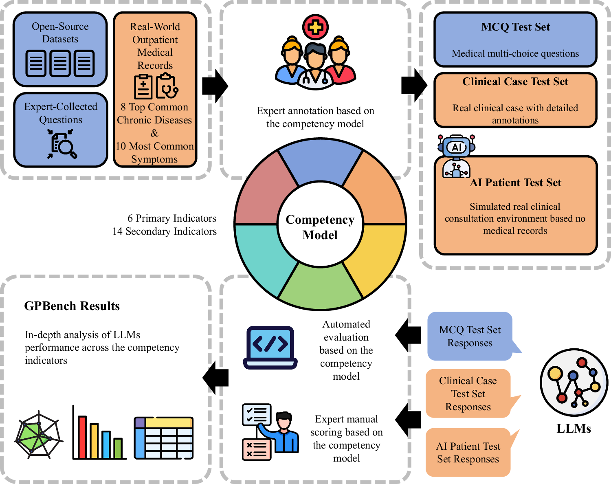
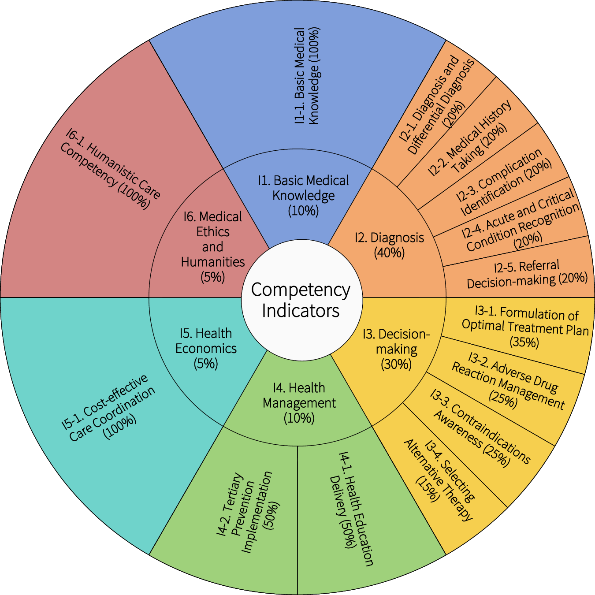
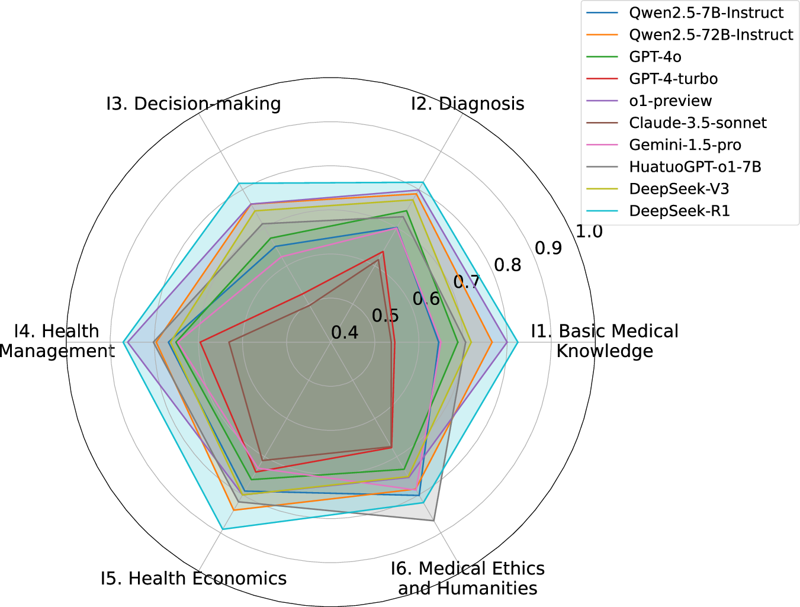
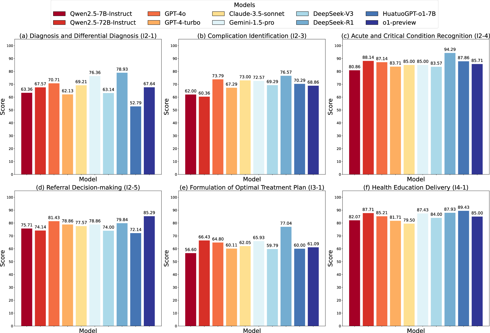
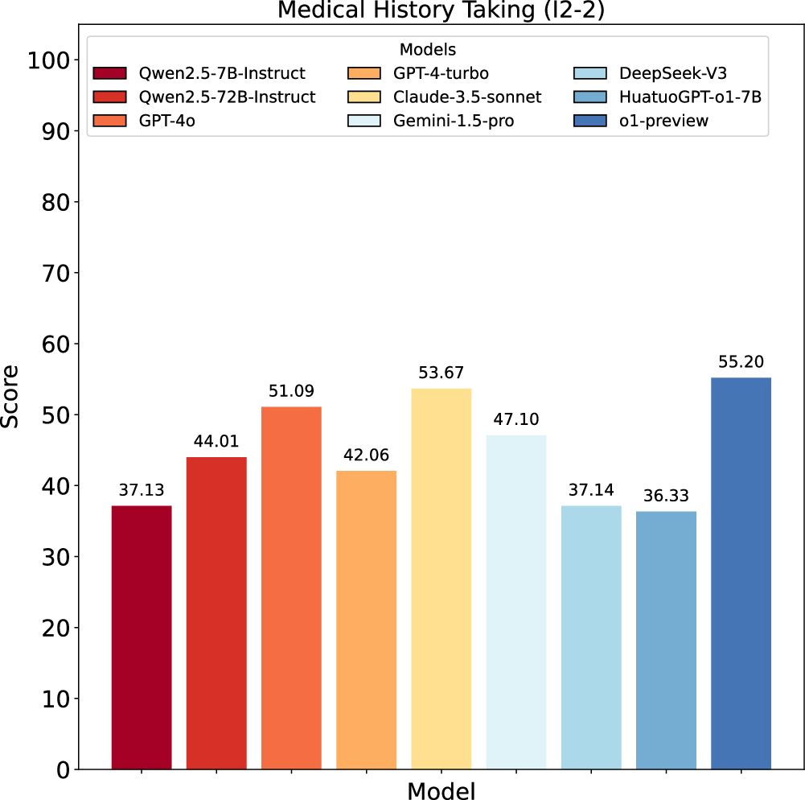
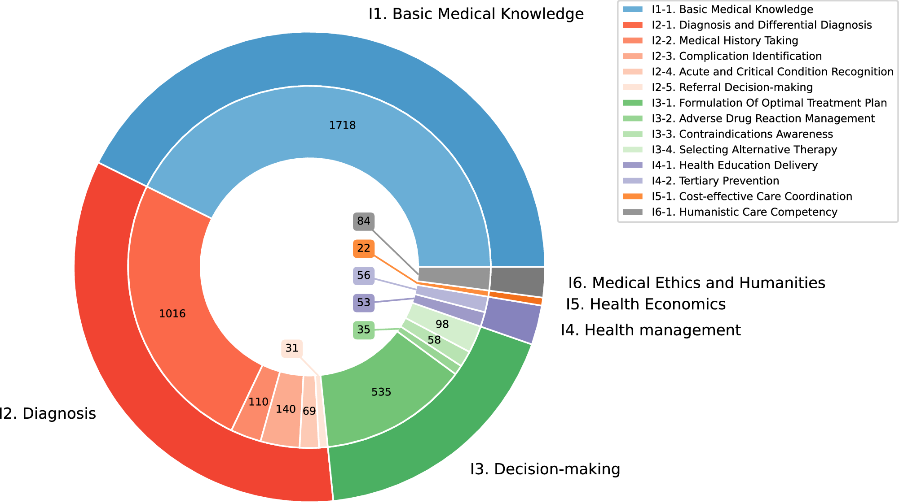

# GPBench 主图逐图深入分析

**语言：中文 | [English](figure-analysis_en.md)**

论文：Li Z, Yang Y, Lang J, et al. *Evaluating clinical competencies of large language models with a general practice benchmark*. **Nature Communications** 2026;17:5302. [DOI](https://doi.org/10.1038/s41467-026-71622-6)

> 本文件聚焦“作者怎样在图中描述 benchmark 与结果”。数值和结论均按论文正文及官方主图核对；“对 ImplantAgent 的启发”属于项目分析，不是原文结论。

## Figure 1：benchmark 总工作流

- **画了什么：** 左上为三类数据来源，中上为专家基于能力模型标注，右上为三类测试集，右下为 LLM 响应，中下为自动或人工评分，左下为分能力域结果。
- **视觉编码：** 粗箭头给出顺时针流程；蓝/橙色在来源、测试和响应之间保持语义对应；虚线圆角框把阶段分组；中心能力模型作为标注与评分的共同轴心。
- **支持的主张：** GPBench 不是单一题库，而是“能力模型 + 三类评测数据 + 双评分机制”的系统。
- **没有证明：** 图中没有样本量、病例来源偏倚、专家一致性或结果有效性；流程完整不等于 benchmark 已被外部验证。
- **值得借鉴：** 让同一个临床框架同时约束“标注”和“评分”，并在主图中把自动评分与专家评分分开。
- **对 ImplantAgent：** 可映射为 CBCT/缺牙位/分割 → 候选生成与约束检查 → 自动方案、辅助输出或 manual_review → 几何自动指标 + 专家可接受性评分 → 病例级结果。
- **应避免：** 图标过多、说明文字过长；原图有一处语法错误“based no medical records”，复用时需严格校对。
- **来源：** 论文 PDF p.2, Figure 1。

## Figure 2：所有评分内容和权重

- **画了什么：** 内圈列六个一级域；外圈列十四个二级指标；一级域在总分中的权重为 10%、40%、30%、10%、5%、5%，二级权重为域内分配。
- **视觉编码：** 颜色表示一级域；扇区角度表达权重；同色内外扇区表达父子关系。
- **支持的主张：** 作者确实在一张图里完整说明“评什么”和“各项多重要”。这正是用户询问的“把 benchmark 全部评分项画在一张图里”的明确 Nature Portfolio 例子。
- **没有证明：** 权重来自 Delphi 共识而不是预测效度优化；图不显示专家间分歧、置信范围或改变权重后排名是否稳定。
- **值得借鉴：** 父域—子域—权重三件事一次展示；正文再解释各域操作性定义。
- **对 ImplantAgent：** 只有在评分域与权重获临床批准后，才适合画同类图。安全硬约束最好单独置于门控层，避免被其他高分抵消。
- **应避免：** 长标签旋转造成阅读负担；扇区面积容易被误读为样本量。可考虑右侧层级条带图替代圆形旭日图。
- **来源：** 论文 PDF p.2–3, p.8, Figure 2；详细定义在 Supplementary Data 1。

## Figure 3：MCQ 多能力域结果

- **画了什么：** 十个模型在六个一级能力域上的加权 MCQ 得分。
- **视觉编码：** 每条有色折线/多边形代表一个模型；越外表示得分越高；轴从 0.4 而不是 0 开始。
- **支持的主张：** 能快速看到模型“能力轮廓”和域间不均衡，DeepSeek-R1 的轮廓整体更靠外。
- **没有证明：** 曲线重叠很严重，没有误差条或显著性标记；截断径向轴会放大视觉差异。
- **值得借鉴：** 若模型很少（约 3–5 个），雷达图可作为能力画像；模型多时应优先用热图或点区间图。
- **对 ImplantAgent：** 更适合用“版本 × 评分域”热图，并在每格提供病例级 bootstrap CI；雷达图可只展示最终版本、基线和专家参考三条线。
- **来源：** 论文 PDF p.2–4, Figure 3。

## Figure 4：开放病例的六个核心结果面板

- **画了什么：** 六个面板依次比较诊断/鉴别诊断、并发症识别、急危重症识别、转诊决策、最佳治疗计划和健康教育。
- **视觉编码：** 所有面板统一 0–100 纵轴和模型颜色；柱顶直接标均值；共享图例减少重复。
- **支持的主张：** 不同临床能力的难度明显不同；治疗计划得分整体较低，急危重症识别和健康教育较高。
- **没有证明：** 柱状图未显示病例分布、标准差、置信区间、评分者差异；面板内肉眼差异并不自动等同于统计学显著。
- **值得借鉴：** 一个面板对应一个临床评分域、所有面板同尺度，这是描述 benchmark 结果最清楚的结构之一。
- **对 ImplantAgent：** 可按病例级主终点拆为位置、轴向、深度、直径/长度、安全距离、可执行性等面板；更推荐点估计 + 95% CI + 病例散点，而不是只有柱高。
- **来源：** 论文 PDF p.3–5, Figure 4；补充数据见 Supplementary Table 8。

## Figure 5：单一瓶颈能力

- **画了什么：** 九个模型在病史采集 I2-2 上的平均分；DeepSeek-R1 因指令遵循失败排除。
- **视觉编码：** 单面板柱状图，柱顶精确数字，颜色映射模型。
- **支持的主张：** 所有模型都低于 60，最高为 o1-preview 的 55.20，显示病史采集是共同瓶颈。
- **没有证明：** 未显示 70 例的分布，横轴无模型文字、过度依赖图例；排除模型会改变比较集合。
- **值得借鉴：** 对一个临床关键瓶颈可用独立主图强化信息，但必须把排除原因写进正文或图注。
- **对 ImplantAgent：** 如果 manual_review 触发率或关键结构违规是核心安全指标，可单独画，不要埋在综合图里；同时显示分母、缺失和排除。
- **来源：** 论文 PDF p.4, p.6, Figure 5。

## Figure 6：测试集覆盖分布

- **画了什么：** 3661 道题在六个一级域和十四个二级指标中的数量分布。
- **视觉编码：** 双层环形图把父域与子域连接起来，数字直接标题量，颜色表示一级域家族。
- **支持的主张：** benchmark 的证据量并不均衡；知识和诊断题占主体，部分经济、人文和转诊域样本很少。
- **没有证明：** 题量不等于临床重要性、难度、区分度或评分质量；也不能说明某域权重应更高。
- **值得借鉴：** 在结果前后公开每个评分域的样本量，让读者判断估计精度和覆盖空白。
- **对 ImplantAgent：** 画“病例 × 缺牙位/解剖难度/阶段/输出状态”分布，并在结果图标注各分层分母；防止某些关键高风险类型只有极少病例。
- **应避免：** 图例和标签过大、主体被挤压；条形图或马赛克图通常更便于精确比较。
- **来源：** 论文 PDF p.9–10, Figure 6。

## 六张图如何组成论文叙事

| 叙事问题 | 对应图 | 图的任务 |
|---|---|---|
| Benchmark 怎样运行？ | Figure 1 | 工作流与评测闭环 |
| Benchmark 评什么？ | Figure 2 | 全部评分域、层级和权重 |
| 知识型任务总体怎样？ | Figure 3 | 多域能力轮廓 |
| 真实病例各能力怎样？ | Figure 4 | 分域结果小多图 |
| 最明显的交互瓶颈是什么？ | Figure 5 | 单项关键结果 |
| 数据覆盖是否均衡？ | Figure 6 | 评分域样本量审计 |

## 对你的手术方案 benchmark 最直接的画图建议

1. **Figure 1 语法可直接借鉴：** 数据/病例 → 标注或参考方案 → 系统执行状态 → 自动与专家评价 → 结果与失败类型。
2. **Figure 2 只借鉴层级结构，不借鉴内容：** 先确定硬安全门控，再确定可补偿的质量域；权重未批准前只画结构，不画百分比。
3. **Figure 4 是最值得借鉴的结果图：** 每个临床域一个小面板、统一尺度，并增加病例点、95% CI、分母与缺失/复核状态。
4. **Figure 6 必须保留：** 公开不同牙位、上下颌、病例难度、影像条件和输出状态的样本分布。
5. **另加 GPBench 缺少的一张图：** 失败机制/安全门控的 Sankey、状态转移或 first-attributable-failure 图，把“为什么不能自动推荐”画出来。

## 证据边界

GPBench 证明的是一种多层临床 LLM benchmark 的组织和呈现方式。它不验证种植体位置、角度、深度、尺寸、安全距离、临床可接受性或任何 ImplantAgent 阈值；这些必须由本项目的临床协议、参考标准和预先批准的评价计划决定。
