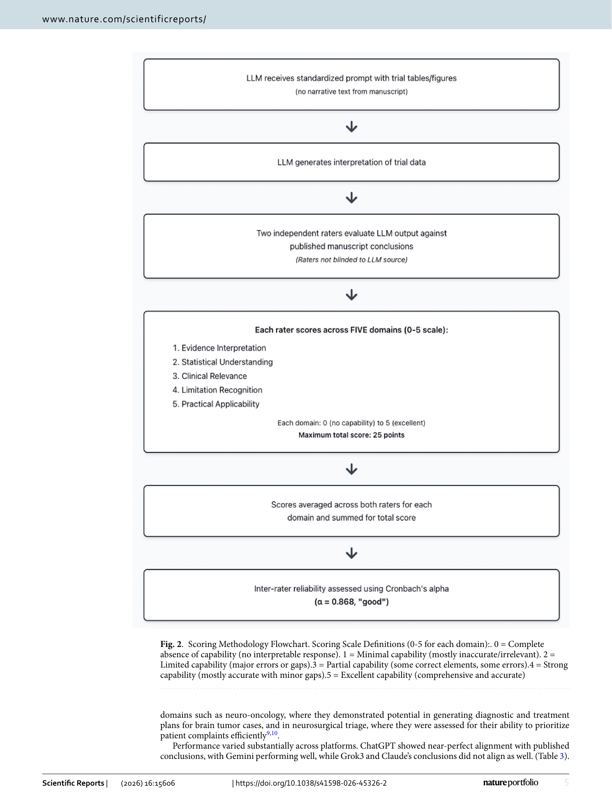

# Paper Card: Benchmarking agreement between large language models and published clinical trial conclusions

**Language: English | [中文](paper-card.md)**

> Source coverage: Full paper; methodology figure retained as a PDF page view
>
> Extraction confidence: High for text; mixed for automatic figure inventory
>
> Locator mode: page-grounded
>
> Primary analytical lens: Clinical evaluation
>
> Secondary analytical lens: Resource / benchmark
>
> Context verification: Official Scientific Reports article checked on 2026-08-07
>
> Card completeness: Complete relative to the main paper

## 01 Basic Information

- [Paper] Gordon Mao, William Snyder III, Anoop S. Chinthala et al.; *Scientific Reports* 16, 15606 (2026), published 2 April 2026. [Paper: PDF p. 1]
- [Paper] DOI: [10.1038/s41598-026-45326-2](https://doi.org/10.1038/s41598-026-45326-2); CC BY-NC-ND 4.0. [Paper: PDF p. 8]
- [Paper] ChatGPT, Gemini, Grok3, and Claude were evaluated on numerical summaries from 20 landmark RCTs. [Paper: PDF pp. 1–2]

## 02 One-Sentence Summary

[Analysis] Two raters score four platforms across five 0–5 domains for agreement with published RCT conclusions, but high scores indicate textual/rubric alignment rather than uncontaminated reasoning, clinical safety, or prospective effectiveness. [Paper: PDF pp. 1–7]

## 03 Research Question

- [Paper] Can LLMs form conclusions aligned with the original papers from structured numerical and statistical inputs? [Paper: PDF pp. 1–2]
- [Paper] How do platforms differ in evidence interpretation, statistical understanding, clinical relevance, limitation recognition, and applicability? [Paper: PDF pp. 2–3]
- [Analysis] Does “agreement” get overinterpreted as original and correct reasoning?

## 04 Research Background and Development Path

1. [Paper] Landmark RCTs were selected to reduce confounding from low-quality study designs. [Paper: PDF pp. 1–2]
2. [Paper] Four platforms received standardized numerical inputs and instructions not to reference the original paper. [Paper: PDF p. 2]
3. [Paper] Two raters independently scored five domains before aggregation and reliability analysis. [Paper: PDF pp. 2–3]
4. [Analysis] The paper is strongest as a transparent scoring-chain example, not as a contamination-free reasoning benchmark.

## 05 Core Pain Points Identified by the Paper

| Pain point | Manifestation | Evidence boundary |
|---|---|---|
| Training contamination | Landmark trials may be memorized | [Paper: PDF pp. 1, 6] |
| Subjective scoring | Two unblinded raters | [Paper: PDF p. 6] |
| Agreement is not correctness | Published conclusions define the reference | [Paper: PDF pp. 2, 6] |
| Best-case sampling | Clear positive landmark trials | [Paper: PDF p. 6] |

## 06 Core Idea

- [Paper] Standardized prompt, five-domain rubric, two raters, and a reliability check. [Paper: PDF pp. 2–3]
- [Analysis] The core reusable contribution is visualizing who scores, what is scored, how scores aggregate, and how rater consistency is checked.
- [Analysis] A surgical benchmark should make rater count, blinding, anchors, arbitration, aggregation, and reliability visible.

## 07 Method Overview

*Figure 2 connects standardized input, four outputs, two independent raters, five 0–5 domains, mean/domain scores, a 25-point total, and inter-rater reliability. [Paper: PDF p. 3, Figure 2]*

Flow: 20 RCT numerical inputs → four platform outputs → two independent domain scores → domain/total aggregation → conclusion agreement → rater reliability.

## 08 Core Module Breakdown

| Module | Function | Risk |
|---|---|---|
| Trial selection | Creates a standardized corpus | Landmark/positive selection bias |
| Structured prompt | Holds the requested task constant | Cannot prevent memory use |
| Five-domain rubric | Separates evaluation dimensions | Subjective interpretation remains |
| Two raters | Independent scoring | Few and unblinded |
| Reliability | Checks score consistency | Does not establish clinical validity |

[Paper: PDF pp. 2–3]

## 09 Essential Formulas and Symbols

- [Paper] Each domain is scored 0–5; the five-domain total is 25. [Paper: PDF p. 3, Figure 2]
- [Paper] Inter-rater reliability is reported with Cronbach's α=0.868. [Paper: PDF pp. 1, 4]
- [Analysis] Alpha describes scoring consistency, not the correctness of model conclusions.

## 10 Experimental Design and Evidence Chain

| Endpoint | Result | Supported conclusion | Unsupported conclusion |
|---|---|---|---|
| Published-conclusion concordance | ChatGPT 100%, Gemini 84%, Grok3 72%, Claude 68% | Platform agreement differs on this corpus | ChatGPT reasons independently without contamination |
| Outcome identification/recommendation | Platform differences | Structured research interpretation can be compared | Patient-level treatment support |
| Five domains | ChatGPT/Gemini perform better on limitations/confounding | Domain reporting adds explanation | Clinical safety validated |
| Rater reliability | α=0.868 | Raters are reasonably consistent | Rubric is unbiased or transportable |

[Paper: PDF pp. 1, 3–6]

## 11 Correct Interpretation of the Conclusions

- [Paper] Training contamination may inflate concordance. [Paper: PDF pp. 1, 6]
- [Paper] Clinical-relevance/applicability scores reflect coherent alignment with published recommendations, not prospectively validated safety. [Paper: PDF p. 6]
- [Paper] The 20 trials cover neurosurgical and cardiovascular interventions and favor clear positive findings. [Paper: PDF pp. 1–2, 6]
- [Analysis] The scoring workflow is reusable; the numerical thresholds are not.

## 12 Limitations Explicitly Acknowledged by the Authors

| Limitation | Manifestation | Direction | Source |
|---|---|---|---|
| Unverifiable contamination | Models may remember the papers | Test newer, ambiguous, negative trials | [Paper: PDF p. 6] |
| Few subjective raters | Two and not blinded | Larger blinded expert panel | [Paper: PDF p. 6] |
| Best-case corpus | Landmark positive trials | Include ambiguous/negative/weak studies | [Paper: PDF p. 6] |
| Novel correct conclusions penalized | Published text is the reference | Allow independently valid conclusions | [Paper: PDF p. 6] |

## 13 Critical Analysis

| [Analysis] Observation | Why it matters | Test |
|---|---|---|
| Concordance is not correctness | The source conclusion may itself be limited | Blinded evidence-to-conclusion validity rating |
| Compensatory 0–25 total | Safety-critical failure can be offset | Add non-compensatory critical-error gates |
| Platforms change rapidly | Results are version/date specific | Archive versions, dates, settings, and raw outputs |

## 14 Knowledge Learned

- Agent-derived knowledge candidate: a scoring figure should expose rater count, independence, anchors, aggregation, and reliability.
- Agent-derived knowledge candidate: retain domains and critical errors beside any total score.
- Agent-derived knowledge candidate: conclusion agreement, expert acceptability, and real outcomes are different endpoints.

## 15 Connections to related research

[Analysis] This paper can inform evidence organization and figure design in related research; its tasks, data, metrics and conclusions cannot be transferred directly to other application domains.

## 16 Open questions

[Analysis] Future work should validate the reported method on independent datasets and report uncertainty, failure cases, and distribution shifts transparently.
