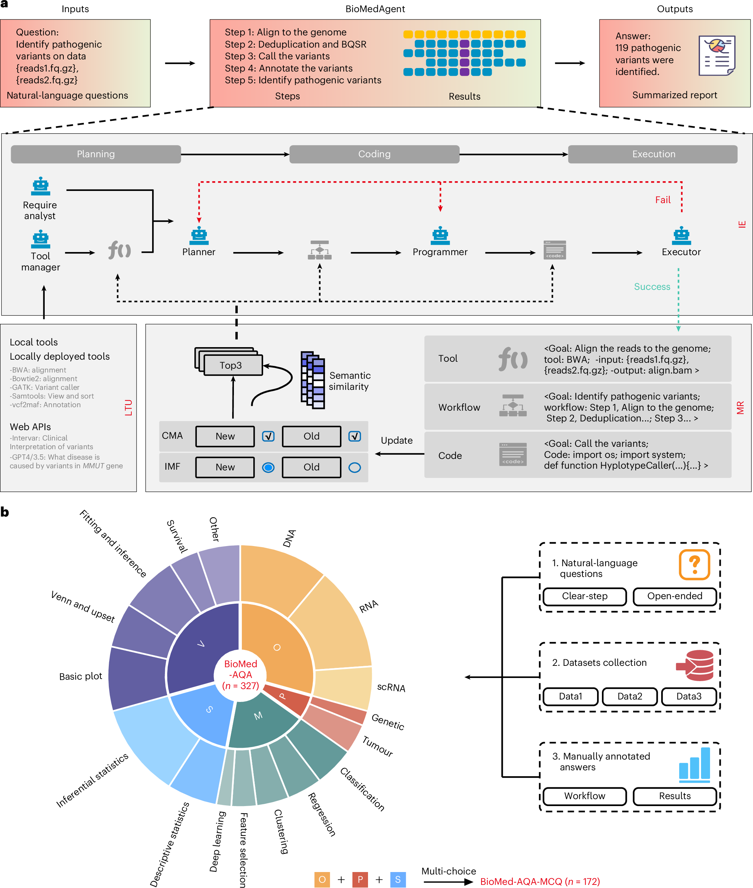
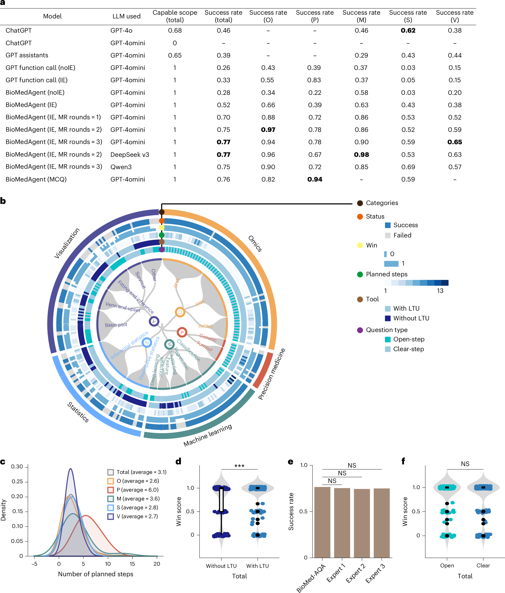
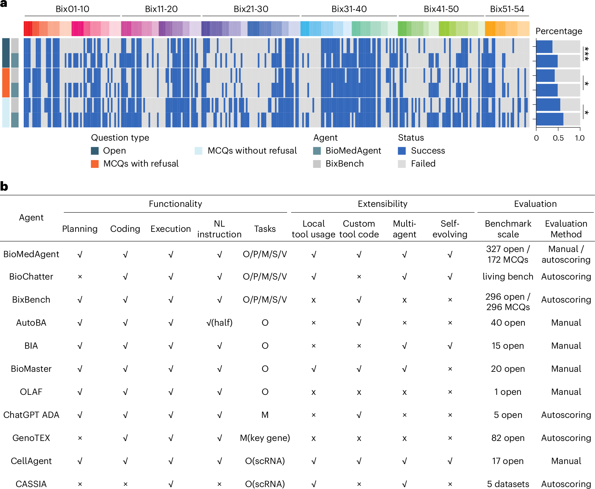

# BioMedAgent：参考图分析

**语言：中文 | [English](figure-analysis_en.md)**

论文：Bu D, Sun J, Li K, et al. *Empowering AI data scientists using a multi-agent LLM framework with self-evolving capabilities for autonomous, tool-aware biomedical data analyses*. **Nature Biomedical Engineering**. 2026. [DOI](https://doi.org/10.1038/s41551-026-01634-6)

- **图的任务：** a 面板画清系统的输入/输出和 planner–programmer–executor 循环，包含失败回路与工具更新；b 面板用环形层级展示 BioMed-AQA 的任务分类和数据构建。
- **可借鉴：** 把“系统工作流”和“benchmark 任务构成”放在同一主图的两个面板，但保持职责分开。
- **局限：** 信息量极大，适合整页主图，不适合压缩到小栏宽。

- **图的任务：** 表格给总体与分类成功率；同心任务图显示逐项 success/fail、Win、计划步数、工具和问题类型；其余面板报告步数分布和组件比较。
- **可借鉴：** 逐任务成功/失败图能暴露哪些类别稳定失败；对 ImplantAgent 更易读的替代是病例×端点热图。
- **局限：** 同心图编码层数多，颜色和图例学习成本高，精确查单个任务困难。

- **图的任务：** 上部按题逐项显示两个系统的成功/失败及题型；下表比较不同 biomedical agents 的规划、编码、工具、规模和评分方法。
- **可借鉴：** 外部 benchmark 不只给一个平均数，还可逐项显示差异，并单独说明各系统的能力范围与评价方式。
- **边界：** 外部任务上的优势不能替代临床外部验证或真实病例结局。

## 对 ImplantAgent 的最直接启发

建议保留“逐病例/逐端点状态热图”，并把失败回路、重试次数、人工介入和最终状态纳入过程性结果；但不要照搬复杂同心图。
