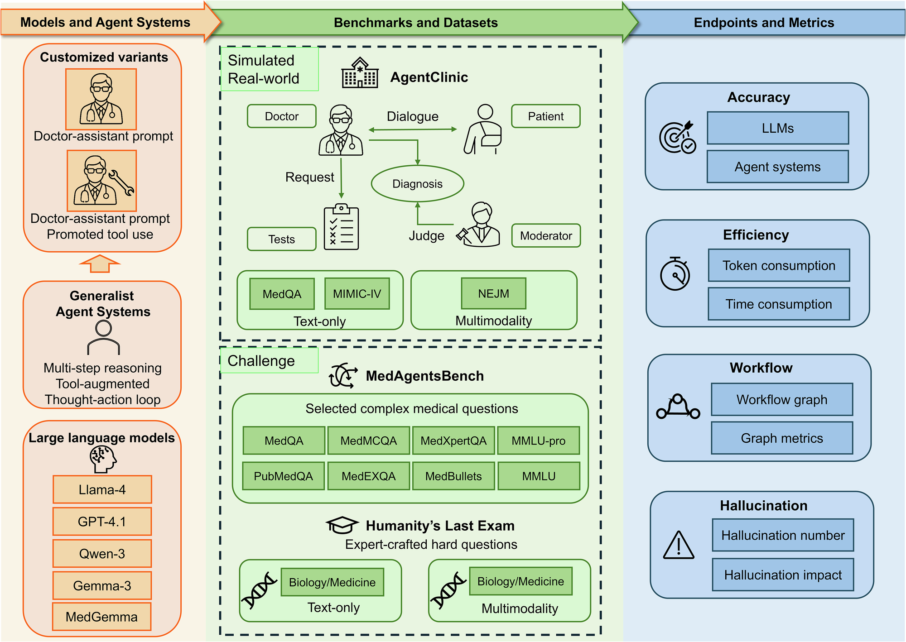
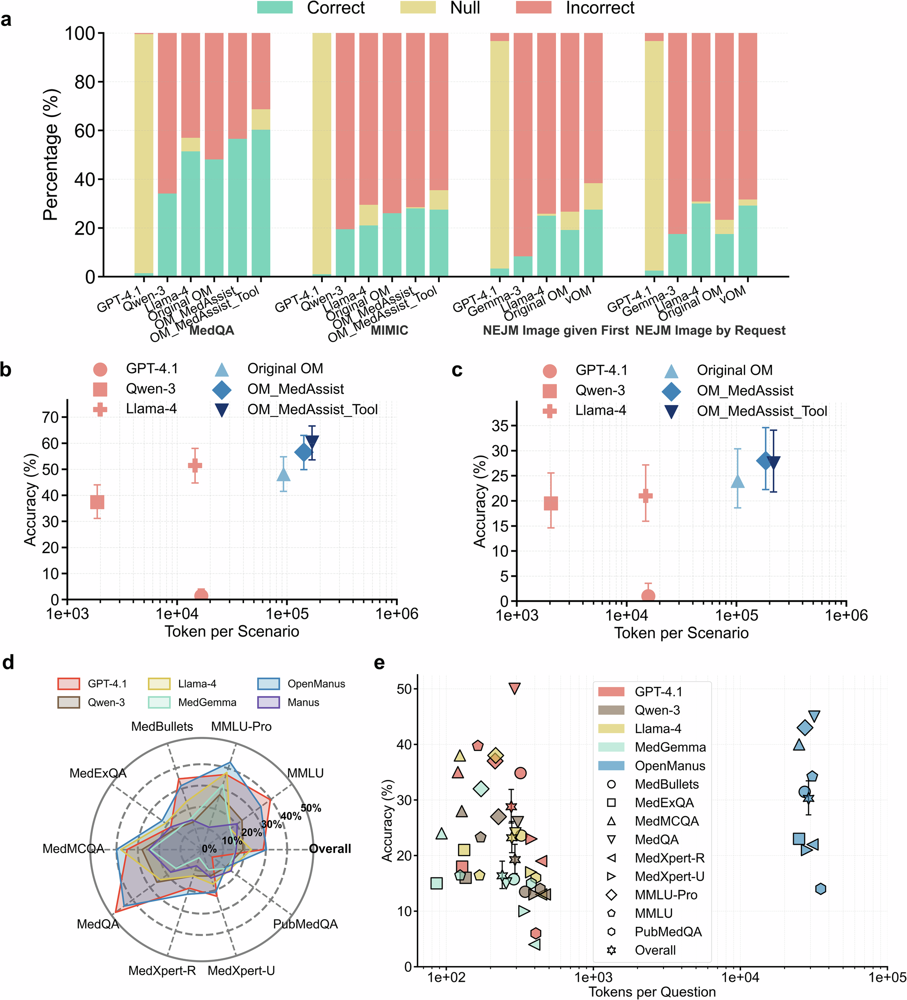

# Clinical agent benchmark：参考图分析

**语言：中文 | [English](figure-analysis_en.md)**

论文：Liu Y, Carrero ZI, Jiang X, et al. *Benchmarking large language model-based agent systems for clinical decision tasks*. **npj Digital Medicine**. 2026;9:259. [DOI](https://doi.org/10.1038/s41746-026-02443-6)

- **图的任务：** 一张图同时列出被比较系统、三类 benchmark/数据集，以及 accuracy、token/time、workflow graph、hallucination 四组端点。
- **可借鉴：** benchmark 总览图不仅画执行流程，也应把“最后报告哪些结果”提前画出来。
- **边界：** 这张图定义研究范围，不显示端点权重、样本量或临床有效性。

- **图的任务：** 用堆叠柱显示结果构成，用带误差线的散点显示准确率—token 消耗，用雷达和多数据集散点补充性能轮廓。
- **可借鉴：** 不只画“准确率最高”，还画性能—成本权衡；Null 应与 Incorrect 分开。
- **局限：** 多种图形塞在一个主图中，阅读负担较高；雷达图仍有重叠问题。

- **图的任务：** 从时间、工作流路径长度、平均节点度到工具调用状态图，解释 agent 为何慢、如何行动。
- **可借鉴：** 结果图从“最终是否正确”深入到“过程怎样发生”；状态流图特别适合 ImplantAgent 的自动输出、manual_review 与失败转移。
- **局限：** 流程图边较多时容易拥挤，需要只保留高频或关键安全路径。

- **图的任务：** 将幻觉分为总数、被阻断、影响诊断，并画出从场景到阻断/影响再到诊断完成的传播图。
- **可借鉴：** “错误发生”与“错误影响最终临床输出”应分开；对应 ImplantAgent 可区分几何异常、被安全门控捕获的异常和真正进入推荐结果的异常。
- **边界：** 该论文的 hallucination 定义与牙科几何失败不同，只能借鉴报告结构。

## 对 ImplantAgent 的最直接启发

主图可按四层组织：病例/任务构成 → 最终正确性或可接受性 → 时间/人工负担 → 工作流状态与失败传播。不要用一个综合分数替代这四层信息。
