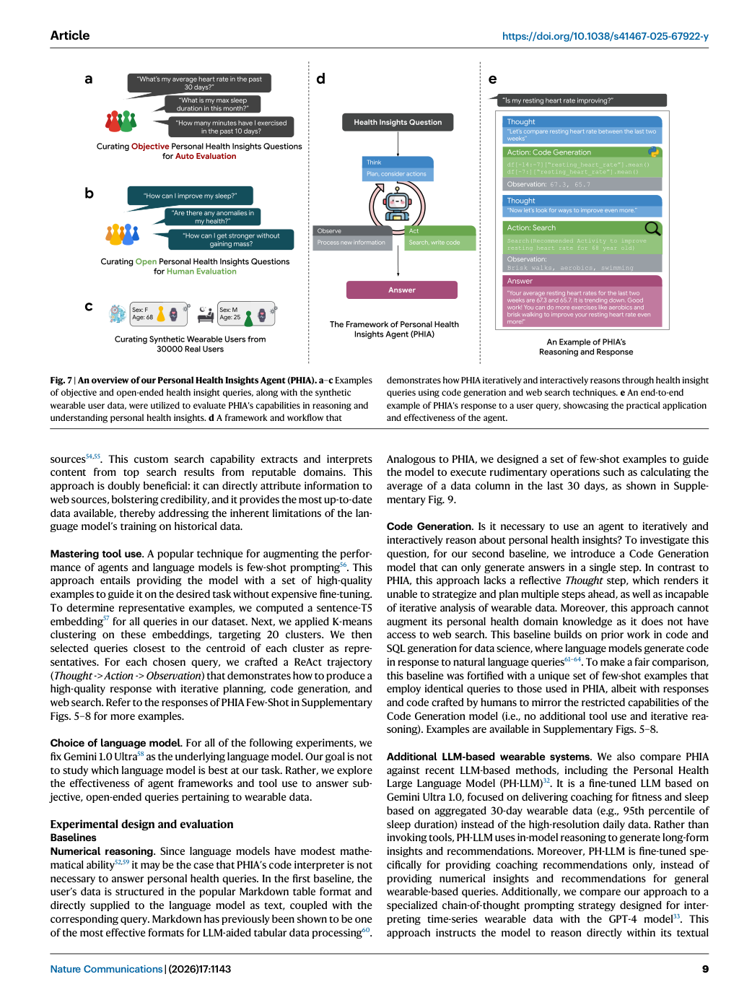
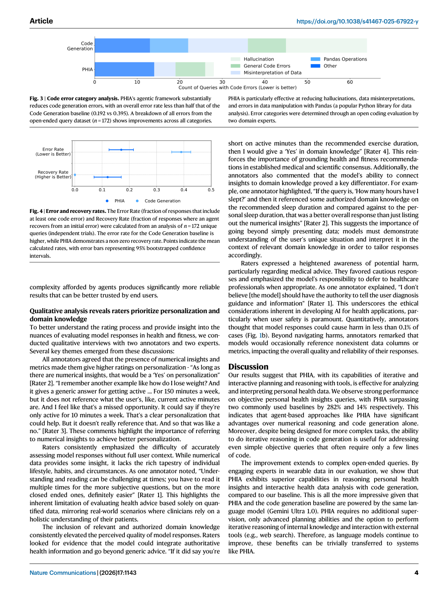
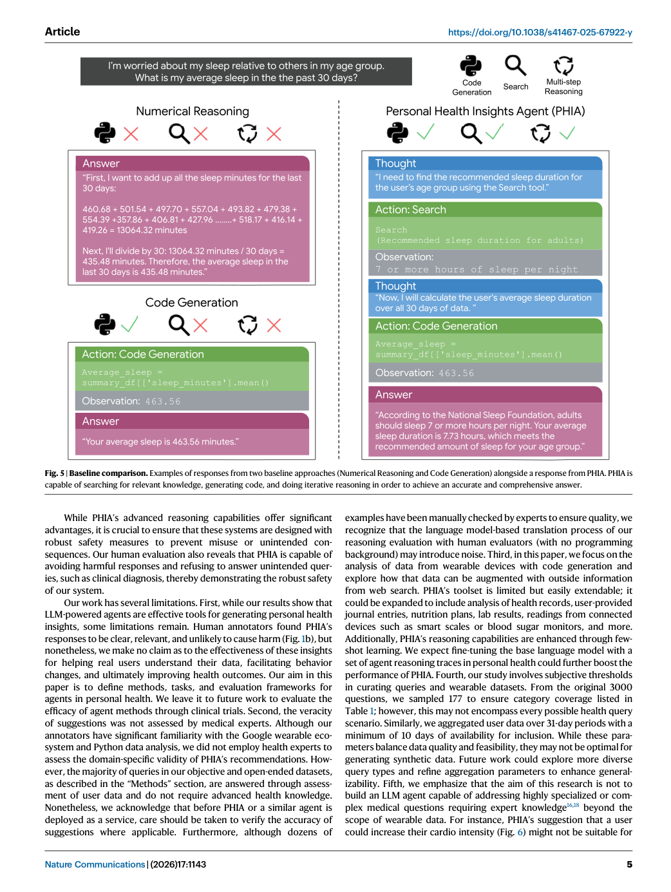

# Paper Card：Transforming wearable data into personal health insights using large language model agents（PHIA）

**语言：中文 | [English](paper-card_en.md)**

> 来源覆盖：完整正文，含 7 幅主图与 2 张主表
>
> 提取置信度：高
>
> 定位模式：page-grounded
>
> 主要分析视角：个人健康智能体评测
>
> 次要分析视角：benchmark 方法 / 安全边界
>
> 上下文核验：2026-08-07 核对 Nature Communications 正式页面
>
> 卡片完整度：相对主文完整

## 术语表

| 术语 | 含义 | 边界 |
|---|---|---|
| PHIA | Personal Health Insights Agent | 结合多步推理、Python 代码执行与网页检索 |
| objective queries | 有确定数值答案的问题 | 可用自动精确度评估 |
| open-ended queries | 需要个体数据与领域知识结合的问题 | 依赖人工主观评分 |
| recovery rate | 首次代码报错后自行修复的比例 | 只反映代理流程中的错误恢复 |

## 01 基本信息

- [原文] Mike A. Merrill 等；*Nature Communications* 17, 1143 (2026)，正式发表 2026-01-12。[Paper:PDF p. 1]
- [原文] DOI：[10.1038/s41467-025-67922-y](https://doi.org/10.1038/s41467-025-67922-y)；正文声明 CC BY-NC-ND 4.0。[Paper:PDF p. 12]
- [原文] 研究发布 PHIA 以及两个合计超过 4,000 个个人健康洞察问题的 benchmark。[Paper:PDF pp. 1, 8–10]
- [原文] 主要底座固定为 Gemini 1.0 Ultra，目的是隔离智能体框架和工具使用的效应，而不是比较底座模型排名。[Paper:PDF pp. 6, 9]

## 02 一句话总结

[分析] PHIA 把“穿戴数据问题”拆成规划、代码计算、检索和迭代纠错，并在合成用户数据上优于强代码生成基线；但文章证明的是 benchmark 上的回答质量与错误恢复，不是临床有效性、真实用户获益或健康结局改善。[Paper:PDF pp. 1, 3–6；Figures 1–7]

## 03 研究问题

- [原文] 智能体工具链能否改善穿戴时间序列问题中的数值推理？[Paper:PDF pp. 1–2]
- [原文] 对开放式问题，多步代理是否能提升总体推理、领域知识、个性化与安全性？[Paper:PDF pp. 2–5]
- [原文] 代理是否能减少代码错误并从首次失败中恢复？[Paper:PDF pp. 3–4]

## 04 研究背景与发展路径

1. [原文] 标准 LLM 难以直接处理高分辨率穿戴时间序列，既往系统常依赖预聚合摘要。[Paper:PDF pp. 1–2]
2. [原文] 代码解释器提供数值能力，但一次性代码生成无法观察并纠正执行结果。[Paper:PDF pp. 2–3]
3. [原文] PHIA 采用 Thought–Action–Observation 轨迹，组合 Python 和网页检索。[Paper:PDF pp. 6, 9]
4. [分析] 因此 benchmark 同时需要“答案正确性”和“过程可靠性”两层终点。

## 05 论文识别的核心痛点

| 痛点 | 表现 | 证据 |
|---|---|---|
| 数值推理脆弱 | 单纯 numerical reasoning 仅 22% | [Paper:PDF p. 2, Figure 1] |
| 开放问题难以自动判分 | 需要多维人工标注 | [Paper:PDF pp. 2–4, Figure 1] |
| 一次性代码不能自修复 | Code Generation recovery rate 为 0 | [Paper:PDF pp. 3–4, Figure 4] |
| 健康建议存在越界风险 | 必须拒绝诊断或潜在伤害请求 | [Paper:PDF pp. 5–6] |

## 06 核心思想

- [原文] 将个体穿戴数据分析、外部知识检索和迭代推理放在同一智能体轨迹中。[Paper:PDF pp. 6–9, Figures 6–7]
- [原文] 建立 objective 与 open-ended 两套互补 benchmark，分别对应自动数值评价和人工多维评价。[Paper:PDF pp. 1–3, 8–10, Tables 1–2]
- [分析] 结果图不应只画总分，还应画错误类型、错误率和恢复率。

## 07 方法总览

*Figure 7 将输入数据、objective/open-ended 问题、代理工作流及评价连接成完整闭环；这张图最适合借鉴为手术方案 benchmark 的主流程图。[Paper:PDF p. 9, Figure 7]*

流程：合成穿戴用户数据 → 问题类型 → Thought → Python / Web Search → Observation → 迭代 → 自动或人工评价。

## 08 核心模块拆解

| 模块 | 作用 | 评价边界 |
|---|---|---|
| synthetic user profiles | 避免暴露真实用户数据 | 不等于真实部署人群 |
| Python interpreter | 计算时间序列与个体指标 | 仍会产生索引、连接和执行错误 |
| web search | 补充领域背景和时效信息 | 建议信实性未由医学专家系统核验 |
| ReAct trajectory | 规划、执行、观察和纠错 | 主要在一个底座模型上验证 |
| objective benchmark | 4,000 个数值问题 | 两位小数精度规则 |
| open-ended benchmark | 172 个去重问题 | 12 位标注者、每题 3 人评价 |

## 09 必要公式与符号

- [原文] objective 问题的正确判定要求回答与真值在两位小数精度内一致。[Paper:PDF p. 10]
- [原文] error rate = 含至少一个代码错误的回答比例；recovery rate = 初次报错后由代理自行修复的回答比例。[Paper:PDF pp. 3–4, Figure 4]
- [原文] 主文没有以编号公式作为 benchmark 核心；评价逻辑主要由问题集、评分量表和 bootstrap 置信区间定义。[Paper:PDF pp. 2–4, 10]

## 10 数据集与评测设计

- [原文] Objective：4 个随机合成用户档案上的 4,000 个查询；比较 PHIA、Code Generation、Numerical Reasoning、custom-prompted GPT-4 和 PH-LLM。[Paper:PDF pp. 2, 10, Table 2]
- [原文] Open-ended：约 3,000 个众包问题中随机抽取 200 个，去除高语义相似项后得到 172 个独立问题，覆盖 Table 1 的九类问题。[Paper:PDF p. 8, Table 1]
- [原文] 12 位熟悉穿戴数据的标注者参与，每个回答由 3 位独立标注者评价；全文称人工评估约 650 小时。[Paper:PDF pp. 1, 10]
- [原文] 合成数据生成器依据 30,000 名同意科研使用的匿名真实穿戴用户数据建模。[Paper:PDF p. 8]

## 11 主要结果

*Figure 1 把数值正确率和人工评价并列；Figure 2 再按问题类型比较总体推理，形成“总结果 → 分层结果”的叙事。[Paper:PDF p. 3, Figures 1–2]*

- [原文] Objective accuracy：PHIA 84%，Code Generation 74%，Numerical Reasoning 22%，custom-prompted GPT-4 53.6%；PH-LLM 未能回答 objective queries。[Paper:PDF p. 2, Figure 1]
- [原文] Open-ended 中，PHIA 的回答获得 83% favorable ratings，获得最高质量评级的概率约为基线两倍。[Paper:PDF p. 1]
- [原文] 人工维度中 PHIA 的 overall reasoning 为 68% 对 52%，domain knowledge 为 63% 对 38%。[Paper:PDF pp. 2–3, Figure 1]

*Figure 3 将代码失败按类别拆开，Figure 4 将“发生错误”和“是否恢复”分离。[Paper:PDF pp. 3–4, Figures 3–4]*

- [原文] PHIA error rate 0.192，Code Generation 0.395；PHIA recovery rate 11.4%，基线为 0。[Paper:PDF pp. 3–4, Figures 3–4]

*Figure 5 用同一问题的并列响应解释数值推理、代码生成和 PHIA 的定性差异。[Paper:PDF p. 5, Figure 5]*

*Figure 6 展示高分回答的工具调用和多步推理证据。[Paper:PDF p. 7, Figure 6]*

## 12 作者讨论与解释

- [原文] 同一底座下错误率下降，支持“规划与观察执行结果”而非仅换模型带来的收益。[Paper:PDF p. 3]
- [原文] 标注访谈显示，具体数值、用户上下文和领域知识会影响个性化评分。[Paper:PDF p. 4]
- [分析] 这是“智能体是否真的增益”的较强设计，因为它把底座能力与代理流程尽量分开。

## 13 作者明确局限、风险与未解决问题

- [作者局限] 不声称洞察能帮助真实用户理解数据、改变行为或改善健康结局；需要临床试验或用户研究。[Paper:PDF pp. 5–6]
- [作者局限] 建议真实性没有由医学专家评价。[Paper:PDF p. 5]
- [作者局限] 研究限于消费级穿戴设备可监测的情况，不适用于复杂或专科医疗问题。[Paper:PDF pp. 5–6]
- [作者局限] 未做真实世界部署；主要固定 Gemini 1.0 Ultra，跨模型推广只是作者假设而非已证实结论。[Paper:PDF p. 6]
- [分析风险] 合成用户和熟悉 Google 穿戴生态的标注者可能低估真实用户分布、沟通差异和临床风险。

## 14 可复用的作图与 benchmark 表达方式

1. Figure 7：一张图声明输入、任务、智能体、工具与评分闭环。
2. Figure 1：自动终点与人工终点并排，避免把不同证据层级混成一个总分。
3. Figure 2：用问题类别差值图说明增益出现在哪里。
4. Figures 3–4：把失败分类、发生率与恢复能力分开画。
5. Figures 5–6：用代表性案例解释定量结果背后的工作流。

[分析] 对手术方案 benchmark，可直接映射为：病例输入 → 方案生成/工具调用 → 客观几何指标 + 专家评分 → 失败类型 → 自我修正前后对照。

## 15 项目迁移建议

- [建议] 将“可自动算的几何/安全指标”和“需专家判断的方案合理性”分成两个评分层。
- [建议] 对每个失败记录发生阶段：输入理解、解剖定位、参数计算、方案生成、复核、修正。
- [建议] 同时报告原始错误率、检测率、修复率和最终暴露率，不用单一成功率掩盖过程风险。
- [边界] PHIA 的 84% 等数值不能作为手术方案系统阈值；场景、数据和风险完全不同。

## 16 新研究设想

**设想：带“可验证工具轨迹”的手术方案智能体 benchmark**

- 临床/科学缺口：最终方案合格并不能说明智能体是否在错误解剖或错误参数上偶然得到可接受结果。
- 最小可行实验：同一批病例比较一次性方案生成、代码/测量工具增强、带观察与自修正的多步智能体。
- 主要终点：关键几何约束满足率、专家盲评接受率、错误率、修复率、最终未拦截风险。
- 如何验证（最低验证集合）：患者级独立划分；同一底座、同一工具预算；双人专家评价；分阶段轨迹审计。
- 可能失败（失败判据）：智能体没有提高最终合格率，或提高合格率但显著增加未检测的高风险路径。
- 创新状态：需要系统文献检索后确认；当前是受 PHIA 评价结构启发的项目假设。
