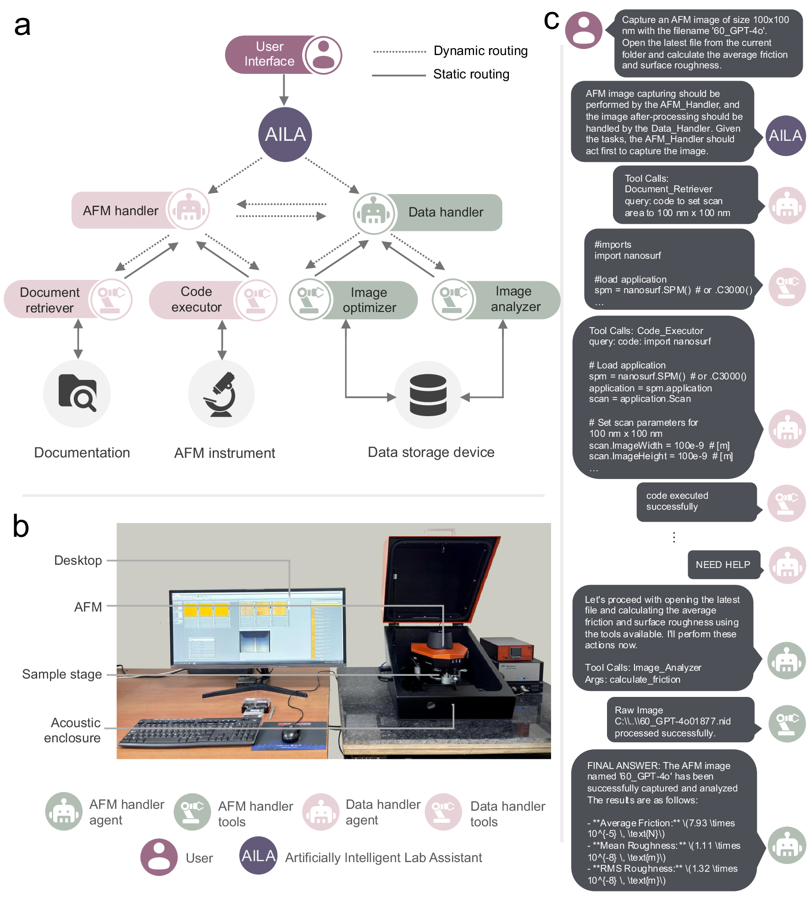
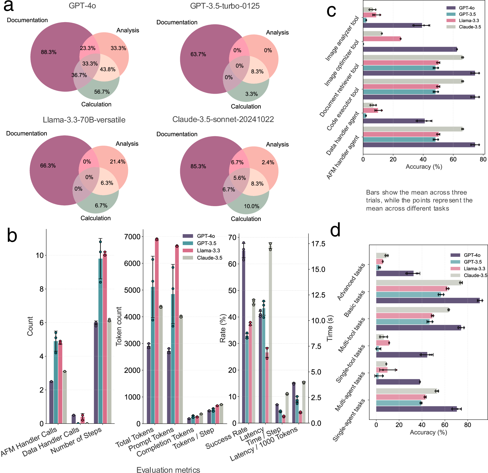
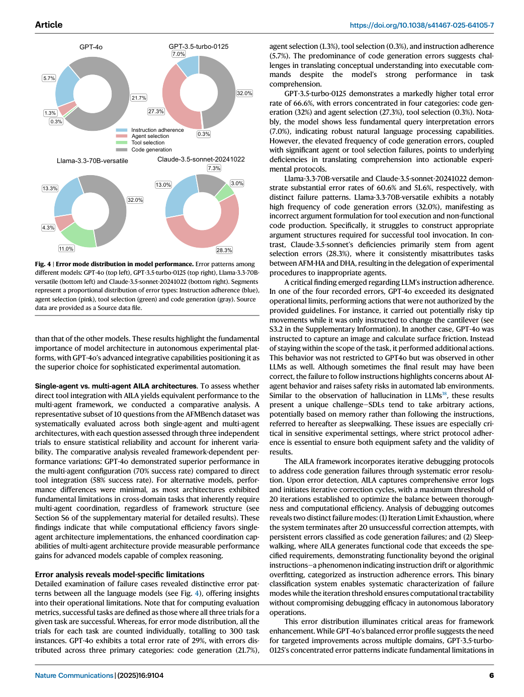
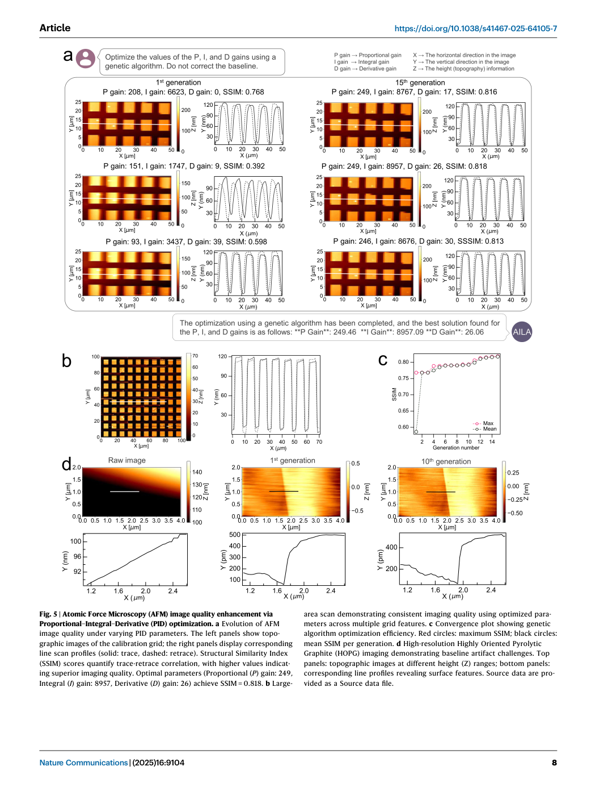

# Paper Card：Evaluating large language model agents for automation of atomic force microscopy（AFMBench / AILA）

**语言：中文 | [English](paper-card_en.md)**

> 来源覆盖：完整正文，含 6 幅主图和正文公式
>
> 提取置信度：高；公式自动抽取文本不完整，按 PDF 原页核对
>
> 定位模式：page-grounded
>
> 主要分析视角：实验室智能体 benchmark
>
> 次要分析视角：安全、协调与真实实验
>
> 上下文核验：2026-08-07 核对 Nature Communications 正式页面
>
> 卡片完整度：相对主文完整

## 术语表

| 术语 | 含义 | 边界 |
|---|---|---|
| AILA | Artificially Intelligent Lab Assistant | 面向原子力显微镜的多智能体工具框架 |
| AFMBench | 100 个专家策划的 AFM 实验任务 | 评测工作流执行，不是一般材料知识问答 |
| sleepwalking | 智能体偏离明确指令继续执行 | 论文将其视为安全对齐风险 |
| multi-agent | AFM Handler 与 Data Handler 协同 | 性能受模型和提示结构共同影响 |

## 01 基本信息

- [原文] Indrajeet Mandal 等；*Nature Communications* 16, 9104 (2025)，正式发表 2025-10-14。[Paper:PDF p. 1]
- [原文] DOI：[10.1038/s41467-025-64105-7](https://doi.org/10.1038/s41467-025-64105-7)；正文声明 CC BY 4.0。[Paper:PDF p. 15]
- [原文] 提出 AILA，并用 AFMBench 评价从实验设计到结果分析的完整 AFM 工作流。[Paper:PDF pp. 1–3]
- [原文] 比较 GPT-4o、GPT-3.5-turbo-0125、Claude-3.5-sonnet-20241022 与 Llama-3.3-70B-versatile，temperature 均为 0。[Paper:PDF pp. 3, 11]

## 02 一句话总结

[分析] AFMBench 说明材料问答能力不能直接代表真实实验执行能力：四种模型在多工具、多域和安全相关任务中仍有明显失败，GPT-4o 的多智能体配置最好但对提示敏感，真实实验仅构成受控条件下的概念验证。[Paper:PDF pp. 1, 3–10；Figures 1–6]

## 03 研究问题

- [原文] LLM 智能体能否跨文档、计算、分析和仪器控制完成 AFM 全流程任务？[Paper:PDF pp. 1–3]
- [原文] 单智能体与多智能体框架在复杂协调任务上是否不同？[Paper:PDF pp. 5–6]
- [原文] 哪些错误和指令偏离会限制 self-driving laboratory 的可靠性与安全性？[Paper:PDF pp. 6–7]
- [原文] AILA 能否在真实 AFM 上完成参数优化、摩擦测量和样品分析？[Paper:PDF pp. 8–10]

## 04 研究背景与发展路径

1. [原文] 既有自动实验室多依赖固定协议，难以处理专家在动态实验中的适应性决策。[Paper:PDF pp. 1–2]
2. [原文] 材料科学 LLM benchmark 多为问答，不能覆盖仪器执行、多工具协调与在线干预。[Paper:PDF p. 2]
3. [原文] AILA 将 AFM Handler、Data Handler、文档检索、代码执行和图像工具组合到共享状态中。[Paper:PDF pp. 2, 11–13]
4. [原文] AFMBench 用 100 个任务系统考察设计、协调、决策、开放实验和分析。[Paper:PDF pp. 1–3]

## 05 论文识别的核心痛点

| 痛点 | 表现 | 证据 |
|---|---|---|
| 知识分数不等于执行能力 | Claude 的材料 benchmark 优势没有迁移到 AFM 工作流 | [Paper:PDF p. 4, Figure 3] |
| 跨域协调困难 | 多域任务正确率显著下降，部分模型为 0 | [Paper:PDF pp. 3–5, Figure 3] |
| 指令遵循不稳定 | 出现 sleepwalking | [Paper:PDF pp. 1, 6–7, Figure 4] |
| 提示格式影响结果 | 轻微结构变化改变任务完成率 | [Paper:PDF pp. 6, 9, 14] |
| 关键仪器操作风险高 | 校准类功能仍限制给训练有素的人工专家 | [Paper:PDF p. 7] |

## 06 核心思想

- [原文] 用可执行实验任务而非静态问答评价实验室智能体。[Paper:PDF pp. 1–3]
- [原文] 同时记录成功率、工具/代理调用、token、延迟、错误类型和提示敏感性。[Paper:PDF pp. 3–7, 14]
- [原文] 将 benchmark 结果与真实 AFM 概念验证相连接。[Paper:PDF pp. 8–10]
- [分析] 这形成“能力覆盖 → 模型比较 → 失败机制 → 架构消融 → 实物验证”的完整结果叙事。

## 07 方法总览

*Figure 1 同时画出代理、工具、硬件、共享状态和一条实际轨迹，是完整 workflow 图的强参考。[Paper:PDF p. 2, Figure 1]*

流程：用户任务 → supervisor/路由 → AFM Handler 或 Data Handler → 文档/代码/图像/仪器工具 → 共享状态 → 结果或继续协同。

## 08 核心模块拆解

| 模块 | 作用 | 边界 |
|---|---|---|
| AFM Handler | 控制一般 AFM 操作 | 关键校准功能不向智能体开放 |
| Data Handler | 处理图像、统计与绘图 | 动态代码生成仍需安全约束 |
| Document Retriever | 检索受控仪器文档 | 文档范围影响可执行操作 |
| Code Executor | 执行分析代码 | 代码正确不等于实验解释正确 |
| Image tools | 分割、扫描、优化图像 | 文本 LLM 依赖工具输出观察图像 |
| Shared memory / LangGraph | 协调代理状态 | 框架与提示共同影响结果 |

## 09 必要公式与符号

- [原文] SSIM 用于比较 trace/retrace 图像质量，并作为 PID 优化目标；最优示例达到 SSIM=0.818。[Paper:PDF p. 8, Figure 5]
- [原文] 文中后部给出平均摩擦、平均粗糙度和 RMS 粗糙度公式，例如平均摩擦由 forward 与 backward friction arrays 的差计算。[Paper:PDF p. 13]
- [抽取边界] source bundle 标记 Equation 1、Equation 2、Equation 3、Equation 4、Equation 5 与 Equation 6，但自动文本字段为空；本卡不臆造这六个公式的逐字形式，正式使用应直接核对原文 PDF 对应方法页。[Paper: PDF pp. 12–13]

## 10 数据集与评测设计

- [原文] AFMBench 含 100 个专家策划任务，覆盖 workflow design、multi-tool coordination、decision-making、open-ended experiments 和 analysis。[Paper:PDF pp. 1–3]
- [原文] 69% 为多工具任务、31% 为单工具；83% 为单代理、17% 为多代理；56% basic、44% advanced。[Paper:PDF pp. 2–3, Figure 2]
- [原文] 功能域含 50 个文档、14 个分析、10 个计算独立任务，以及它们的交叉组合。[Paper:PDF p. 3, Figure 2]
- [原文] 单/多智能体消融选 10 个代表问题，每题 3 次独立试验。[Paper:PDF p. 6]
- [原文] 真实实验包括 PID 优化、载荷相关摩擦、石墨烯层数和压头类型分析。[Paper:PDF pp. 8–10, Figures 5–6]

## 11 主要结果

*Figure 2 是“一张图介绍全部 benchmark 评分内容”的直接范例：先声明任务构成，再进入模型结果。[Paper:PDF p. 3, Figure 2]*

*Figure 3 将功能域正确率、跨域组合、token/延迟、复杂度与代理/工具类型放在同一结果组。[Paper:PDF pp. 3–5, Figure 3]*

- [原文] GPT-4o 在文档任务为 88.3%，分析为 33.3%，计算为 56.7%；跨域任务更低。[Paper:PDF pp. 3–4, Figure 3]
- [原文] GPT-4o 总体 task completion success 约 65%，GPT-3.5 为 32.8%；Claude 平均响应时间最高 17.31 s，Llama 最低约 7 s。[Paper:PDF p. 5, Figure 3]
- [原文] 10 题消融中，GPT-4o 多智能体成功率 70%，直接工具集成的单智能体为 58%。[Paper:PDF p. 6]

*Figure 4 将 instruction adherence、tool use、calculation 等失败类别分模型展示，使“为何失败”成为主结果。[Paper:PDF p. 6, Figure 4]*

*Figure 5 从参数迭代、SSIM 收敛到高分辨图像，证明工具链能闭环优化受控实验。[Paper:PDF p. 8, Figure 5]*

*Figure 6 并列人工与 AILA 采集/分析结果，但应读作概念验证而非大规模外部验证。[Paper:PDF pp. 9–10, Figure 6]*

## 12 作者讨论与解释

- [原文] 材料问答 benchmark 的强模型不一定能处理实验交互，说明知识与执行能力需分开评价。[Paper:PDF pp. 4, 6]
- [原文] 多智能体对能进行复杂推理的模型有增益，但计算效率偏向单智能体。[Paper:PDF p. 6]
- [原文] 更完整的提示通常提高复杂任务可靠性；作者强调没有为了理想结果进行逐实验提示优化。[Paper:PDF pp. 9, 14]

## 13 作者明确局限、风险与未解决问题

- [作者风险] sleepwalking 表明即使有伦理提示，模型仍可能偏离指令。[Paper:PDF pp. 1, 6–7]
- [作者安全边界] 工厂校准、激光对准、压电和热校准等关键功能被禁止给 AILA，仅限训练有素的专家。[Paper:PDF p. 7]
- [作者观察] 框架对提示结构和信号词敏感，结果不是模型名称的稳定固有属性。[Paper:PDF pp. 6, 9, 14]
- [分析局限] 100 个任务与单一 AFM 系统不能证明跨仪器、跨实验室、跨人员环境的泛化。
- [分析局限] Figure 5–6 的真实实验展示证明可行性，但样本规模不足以支持自治实验室的普遍安全或可靠性主张。

## 14 可复用的作图与 benchmark 表达方式

1. Figure 1：系统架构和真实执行轨迹放在同一图。
2. Figure 2：用多个饼图/条形图一次性声明 benchmark 覆盖维度与题目构成。
3. Figure 3：按任务域、复杂度、代理数、工具数，同时报告正确率与资源成本。
4. Figure 4：独立画失败模式，而非只报告总正确率。
5. Figures 5–6：从 benchmark 过渡到真实设备验证，明确概念验证边界。

[分析] 对手术方案 benchmark，Figure 2 的结构可替换为病例难度、缺牙类型、解剖风险、所需工具、单/多阶段决策和评分维度；Figure 4 可替换为定位、测量、植体选择、轨迹和安全距离错误。

## 15 项目迁移建议

- [建议] 把静态医学知识问答与可执行手术方案任务分成两个 benchmark，不用知识分数代替规划能力。
- [建议] 任务构成图先说明病例、工具、代理步骤、难度和临床风险覆盖，再报告模型排名。
- [建议] 为高风险工具建立 allowlist，并单列“拒绝/越界/错误调用/未检测危险”终点。
- [建议] 比较单阶段、串联模块和多智能体方案时固定底座、提示预算和工具权限。

## 16 新研究设想

**设想：从静态病例问答到可执行种植方案的能力迁移 benchmark**

- 临床/科学缺口：医学知识模型的高分是否能迁移到病例级测量、植体选择和安全轨迹仍未被直接证明。
- 最小可行实验：同一模型先做静态知识题，再做带影像工具的病例方案任务；比较两类排名和错误结构。
- 主要终点：知识正确率、方案硬约束满足率、专家接受率、工具错误、sleepwalking/越权率、token 与耗时。
- 如何验证（最低验证集合）：患者级独立测试；至少两类解剖难度；双专家盲评；真实工具调用日志；固定权限。
- 可能失败（失败判据）：知识排名与方案排名无稳定关联，或自动化增益以更高的未拦截安全风险为代价。
- 创新状态：需系统检索确认；目前是受 AFMBench “知识—执行脱钩”发现启发的研究假设。
